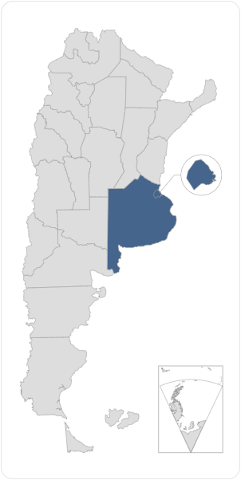
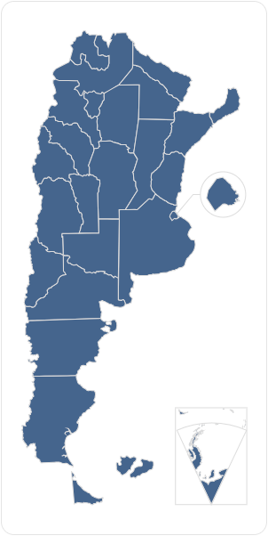
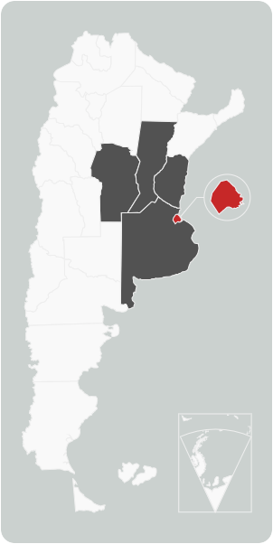

# 📦 Mapa de Argentina SVG


## 🧰 Opciones y métodos

### argentinaMapStyle()

Permite asignar estilos de color de fondo, color de línea y ancho de línea al mapa. 

| Parámetro | Tipo | Default | Descripción |
|:---|:---|:---|:---|
| _color_ | `string` | `#DDDDDD`| Color de fondo para la provincia.   | 
| _provinces_ | `object` | `["*"]` | <p>Permite definir un listado de provincias que deben usar el color asignado.</p><p>Por ejemplo. `["*"]`, Asigna el color a todas las provincias; mientras que un listado de nombres de provincias ISO como: `["AR-C", "AR-B"]`, asigna colores a Buenos Aires y CABA.</p><p>Conozca más sobre el estándar [ISO 3166-2:AR](https://es.wikipedia.org/wiki/ISO_3166-2:AR).</p> |
| _strokeColor_ | `string` | `#CCCACA` | Define el color de las líneas en el mapa. |
| _strokeWidth_ | `float\|integer` | `1` | Define el ancho de las líneas en el mapa. |
| _defaultColor_ | `string` | `#DDDDDD` | Define el color de base. Su uso solo tiene sentido si se quiere utilizar color en algunas provincias. |


## 🚀 Uso

### Ejemplo 1

Ejemplo pintando las provincias: CABA y Buenos Aires de color naranja; asignando un ancho de línea de 0.5 pixels y color de línea gris —#999999—;

<div style="margin:1em auto 1.5em">

</div>


```js
document.addEventListener('DOMContentLoaded', () => {
    argentinaMapStyle({
        provinces: ["AR-C", "AR-B"],
        color: "var(--warning, orange)",
        strokeColor: "#999",
        strokeWidth: .5
    });
});
```

### Ejemplo 2

Pinta todas las provincias de color azul con las líneas de color gris.

<div style="margin:1em auto 1.5em">

</div>


```js
document.addEventListener('DOMContentLoaded', () => {
    argentinaMapStyle({
        provinces: ["*"],
        color: "var(--secondary)",
        strokeColor: "#DDDDDD"
    });
});
```

### Ejemplo 3

<div style="margin:1em auto 1.5em">

</div>

```html
<div class="mapa js-map"></div>
```

```js
document.addEventListener('DOMContentLoaded', () => {
    renderMap(".js-map");
    argentinaMapStyle({
        selectiveColor: [
            ["AR-B", "#525252"],
            ["AR-C", "var(--danger, red)"],
            ["AR-E", "#525252"],
            ["AR-S", "#525252"],
            ["AR-X", "#525252"],
        ],
        defaultColor: "#f9f9f9",
        strokeColor: "#eee",
        strokeWidth: 1
    }, ".js-map");
});
```