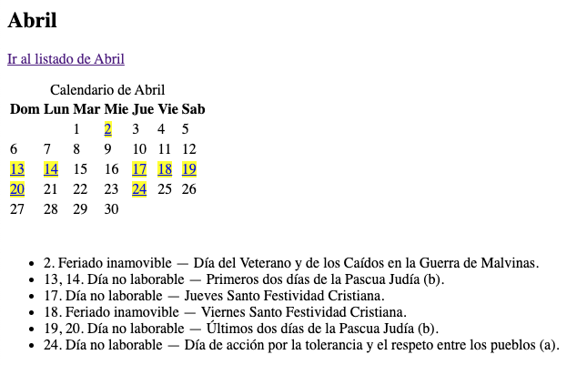
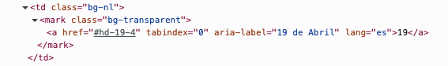

# Changelog

## Release 2.0.0

### Core

- El componente fue refactorizado completamente a JavaScript puro (Vanilla JS), eliminando la dependencia de la librería jQuery.
- Se implementó la funcionalidad para la internacionalización (i18n) de textos mediante el uso de atributos `data-[scope]-[ln]` en las etiquetas HTML, permitiendo la gestión de múltiples lenguajes a través de datasets.
- Se añadió una función específica para la adaptación del texto cuando la diferencia con un feriado o día festivo es de un solo día, aplicando la forma singular de las palabras necesarias.
- Se integró soporte para la localización del calendario en múltiples idiomas utilizando la clave `lang=[ln]` en el objeto de opciones.
- Se implementó la obtención del template mediante `cloneContent` en JavaScript, permitiendo a los maquetadores modificar los estilos generales del bloque del mes de forma sencilla.
- Se corrigió el _bug_ se orurria cuando se visualizaba el calendario desde otro _timezone_, forzando el calendario a: America/Argentina/Buenos_Aires.
- Ahora se puede hacer un documento JSON con indices por idioma, ej:
  

    ```js
    const data = {
        "es": [
            {…}
        ],
        "en": [
            {…}
        ]
    };
    ```


## Accesibilidad

- Se optimizó la presentación de los días restantes para el feriado mediante el uso de etiquetas en línea, evitando la fragmentación visual del texto.
- Se incorporó un enlace invisible visualmente pero accesible mediante lector de pantalla para permitir a los usuarios omitir la tabla del calendario y acceder directamente al listado de feriados y días festivos.
- En la tabla del calendario, cada feriado se identifica mediante la etiqueta `<mark>`, proporcionando una indicación semántica además del estilo visual.
- Cada feriado en la tabla incluye un enlace interno (`<a>` con ancla) que dirige a su descripción detallada en la sección del listado de feriados.
- Se añadió el atributo `aria-label` a la etiqueta `<a>` dentro de `<mark>`, anunciando el día y el mes del feriado en un formato comprensible para usuarios que navegan por enlaces.
- Se aseguró la navegación completa del calendario mediante teclado.
- Se estructuró cada mes del calendario como un elemento `<article>` dentro de la sección principal.
- Cada uno de los items dentro del listado de feriados y días festivos incluye el tipo de feriado al que pertenece. Esta información solo es accesible mediante lector de pantalla.

**Mes con estilos CSS**


_Captura del mes de abril con estilos CSS_

**Mes sin estilos CSS**



_Captura del mes de abril sin estilos CSS. Se pueden ver los días resaltados en color amarillo, el enlace de salto y el tipo de feriado en cada item del listado de feriados y días festivos._


**Día feriado dentro de la tabla con mejora semántica**



_Captura del código html en el que se puede ver la celda de la tabla con el día marcado con su enlace/ancla y el atributo aria-label con el nombre del enlace comprensible fuera de su contexto._

### CSS

- Se incorporaron estilos para resetear el estilo por defecto de la etiqueta `</mark>`.
- Se corrigieron los colores para los enlaces para que se lean correctamente.

----

## version 1.x