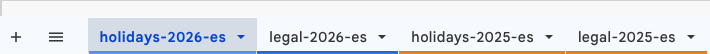
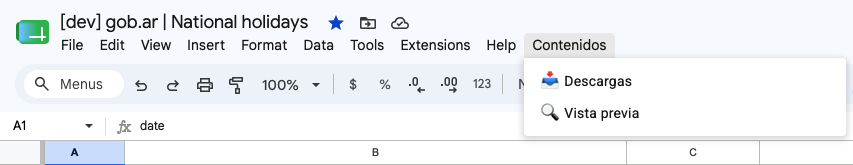
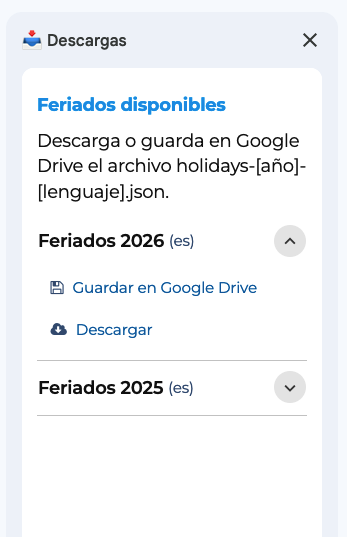
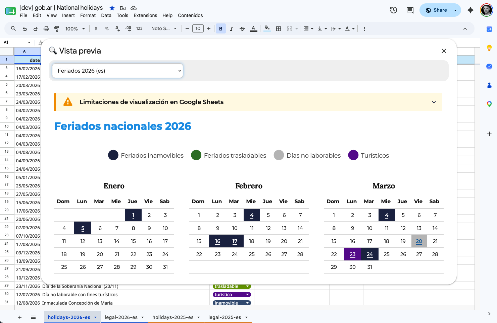
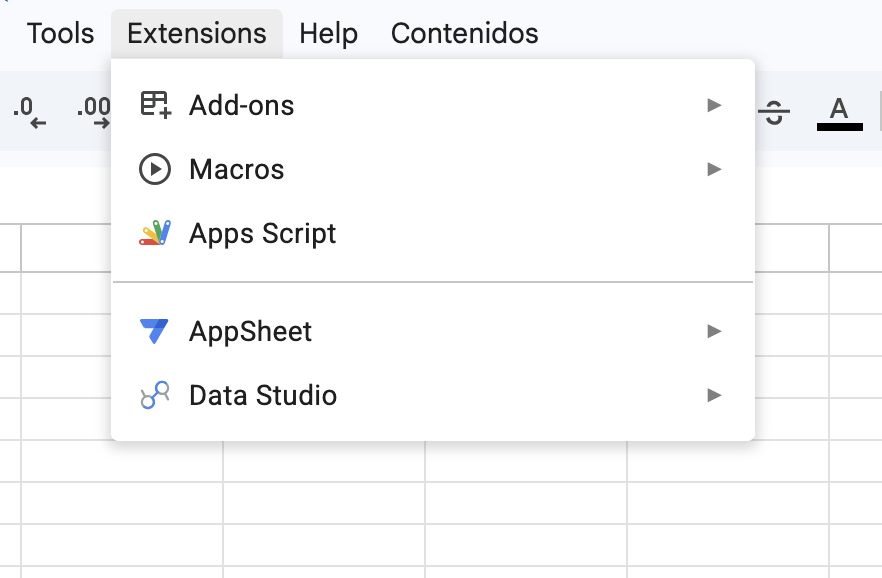

<!-- omit from toc -->
# Visualizador y generador de documentos JSON-LD para feriados nacionales

- [Nomenclatura de las solapas](#nomenclatura-de-las-solapas)
- [Descarga y guardado de archivos](#descarga-y-guardado-de-archivos)
- [Vista previa](#vista-previa)
- [Configuración](#configuración)
  - [Código](#código)

## Nomenclatura de las solapas



Cada calendario utiliza dos solapas para generar el documento JSON-LD: una con el listado de feriados y otra con la información legal asociada a su reglamentación.

El nombre de ambas solapas sigue el mismo esquema:

```text
{prefijo}-{año}-{idioma}
```

| Componente | Descripción                      | Ejemplo              |
|------------|----------------------------------|----------------------|
| `prefijo`  | Identificador del tipo de solapa | `holidays`, `legal`  |
| `año`      | Año completo (cuatro dígitos)    | `2026`               |
| `idioma`   | Código de idioma ISO 639-1       | `es`                 |

> [!NOTE]
> Para cambiar el prefijo, modificar el valor correspondiente en **Apps Script > Settings\.gs**.

**Solapa de listado**

```text
holidays-2026-es
```

**Solapa de legales**

```text
legal-2026-es
```

## Descarga y guardado de archivos



La extensión agrega a Google Sheets un menú que permite descargar o guardar la combinación de ambas solapas convertida al formato JSON-LD (estándar schema.org).

1. Haga clic en **Contenidos** en la barra de menú del documento.

2. En el desplegable, seleccione **Descargas**. Aparecerá un mensaje indicando que el script se está ejecutando y, a continuación, se abrirá un panel lateral con los calendarios disponibles. Cada calendario ofrece una lista desplegable con las opciones de guardado.

3. Elija **Descargar** o **Guardar en Google Drive**.



- **Descargar:** el archivo se descargará en unos segundos. Dependiendo de la configuración del navegador, se abrirá el diálogo para elegir la ubicación o se guardará directamente en la carpeta de descargas predeterminada.
- **Guardar en Google Drive:** el archivo se guardará en la carpeta configurada o, si no hay ninguna asignada, en la raíz del espacio de Google Drive del usuario.

> [!NOTE]
> Para asignar un ID de carpeta de Google Drive, modificar el valor correspondiente en **Apps Script > Settings\.gs**.

## Vista previa



En el desplegable del menú **Contenidos**, seleccione **Vista previa**. Se abrirá una ventana modal con un menú desplegable que lista los calendarios disponibles. Al seleccionar un año, el calendario con las fechas y los textos legales asociados se mostrará en unos segundos.

> [!NOTE]
> Por motivos de seguridad, Google Sheets restringe la ejecución de ciertos eventos dinámicos en el navegador. Como resultado, algunos elementos o complementos del calendario podrían no visualizarse o funcionar correctamente. La vista previa no es idéntica al calendario publicado en argentina.gob.ar.

## Configuración

Para acceder al archivo **Settings.gs**, haga clic en **Extensions** en la barra de menú y seleccione **Apps Script** del desplegable. Se abrirá una nueva ventana con el editor de scripts. En el panel lateral izquierdo se listan todos los archivos; seleccione **Settings.gs**.




### Código

```js
// Carpeta de Google Drive donde se guardan los archivos JSON-LD generados.
const DRIVE_BACKUP_FOLDER = '1Z7PWj6f-...E23j55iZ4pn';

// ID del documento de Google Sheets.
const SPREADSHEET_KEY = '1gu5jRjtdG...GAqOzoVvoG8';

// Prefijo para el nombre del archivo de salida. Formato: [prefijo]-[año]-[idioma].json
const OUTPUT_FILE_PREFIX = 'holidays';

// Idioma por defecto.
const DEFAULT_LANG = 'es';

const SIDEBAR_TITLE = "📥 Descargas";
const MODAL_TITLE = "🔍 Vista previa";
const MODAL_HEIGHT = 650;
const MODAL_WIDTH = 1280;

// Cadenas de texto por idioma.
const i18n = {
    es: {
        name: "Feriados Nacionales {{year}}",
        description: "Calendario de Feriados Nacionales {{year}}",
        publisherOrganization: "Ministerio del Interior",
        type: {
            inamovible: 'Feriado inamovible',
            trasladable: 'Feriado trasladable',
            no_laborable: 'Día no laborable',
            turistico: 'Feriado turístico'
        }
    },
    en: {
        name: "National Holidays {{year}}",
        description: "National Holidays Calendar {{year}}",
        publisherOrganization: "Ministry of the Interior",
        type: {
            inamovible: 'Fixed holiday',
            trasladable: 'Movable holiday',
            no_laborable: 'Non-working day',
            turistico: 'Bridge holiday'
        }
    }
};

```