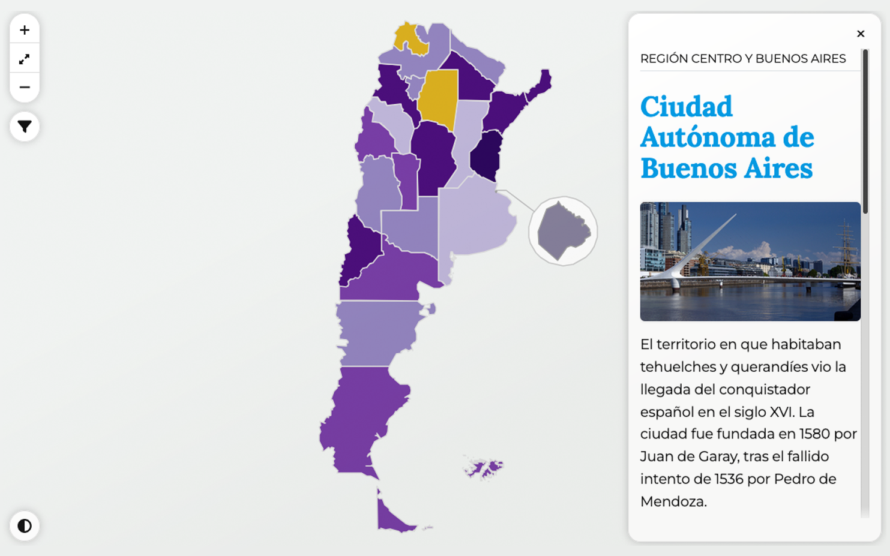

# Mapa de Argentina con filtro por provincias

Módulo para implementar _ponchoMap_ utilizando un GeoJSON con polígonos por provincia.

## **Opciones**

<table>
<thead>
<tr>
<th style="text-align:left">Parámetro</th>
<th style="text-align:left">Tipo</th>
<th style="text-align:left">Default</th>
<th style="text-align:left">Descripción</th>
</tr>
</thead>
<tbody>
<tr>
<td style="text-align:left">initial_entry</td>
<td style="text-align:left"><code>string</code></td>
<td style="text-align:left"><em>empty</em></td>
<td style="text-align:left">Permite asignar una provincia para que se muestre cuando se carga la página. (Ver órdenes de precedencia).</td>
</tr>
<tr>
<td style="text-align:left">random_entry</td>
<td style="text-align:left"><code>boolean</code></td>
<td style="text-align:left"><code>false</code></td>
<td style="text-align:left">Permite que se asigne <em>aleatoriamente</em> una provincia cuando se carga la página. (Ver órdenes de precedencia).</td>
</tr>
<tr>
<td style="text-align:left">overlay_image</td>
<td style="text-align:left"><code>boolean</code></td>
<td style="text-align:left"><em><code>true</code></em></td>
<td style="text-align:left">Si es <em>true</em> (Verdadero en inglés), permite que se visualice la imagen sobrepuesta al mapa de OpenStreetMap (OSM).</td>
</tr>
<tr>
<td style="text-align:left">overlay_image_bounds</td>
<td style="text-align:left"><code>object</code></td>
<td style="text-align:left"><pre style="font-size:smaller"><code>[
    [-20.70565857951651, -24.50543849552044],
    [-88.20759652502107, -74.4619171280653]
]</code></pre></td>
<td style="text-align:left">Geo-localización de las cuatro coordenadas que definen el cuadro visible del mapa.</td>
</tr>
<tr>
<td style="text-align:left">overlay_image_url</td>
<td style="text-align:left"><code>string</code></td>
<td style="text-align:left"><code>/profiles/argentinagobar/themes/contrib/poncho/img/map-shadow-antartida.png</code></td>
<td style="text-align:left">Permite sobreponer una imagen en el mapa OSM.</td>
</tr>
<tr>
<td style="text-align:left">overlay_image_opacity</td>
<td style="text-align:left"><code>float</code></td>
<td style="text-align:left">0.8</td>
<td style="text-align:left">Define la opcidad de la imagen sobrepuesta al mapa.</td>
</tr>
<tr>
<td style="text-align:left">province_index</td>
<td style="text-align:left"><code>string</code></td>
<td style="text-align:left">provincia</td>
<td style="text-align:left">Permite definir cual es el nombre de la columna, o índice del objeto; dónde se debe obtener el nombre de la provincia.</td>
</tr>
<tr>
<td style="text-align:left">toggle_select</td>
<td style="text-align:left"><code>boolean</code></td>
<td style="text-align:left">true</td>
<td style="text-align:left"><dl><dt><code>true</code> (verdadero)</dt><dd>Cuando la opción sea verdadera y  el <em>viewport</em> o tamaño del display sea inferior a los 992 píxeles de ancho, el componente html, select, con el listado de provincias se mostrará, mientras que el mapa permanecerá oculto.</dd>
<dt><code>false</code> (falso)</dt><dd>Cuando la opción sea falsa, tanto el componente html, select, como el mapa estarán visibles en todo momento.</dd></dl>

* Es importante tenes en cuenta que cuando se utilice el mapa completo —mapa con slider o popup—, true ocultará el mapa. Esta opción es aconsejable en modo: mapa con descripción fuera del mapa.
</td>
</tr>
<tr>
<td style="text-align:left">hide_select</td>
<td style="text-align:left"><code>boolean</code></td>
<td style="text-align:left">false</td>
<td style="text-align:left">Si la opción es <em>true</em>, el componente html, select, se muestra unicamente en modo mobile.</td>
</tr>
<tr>
<td style="text-align:left">fit_bounds</td>
<td style="text-align:left"><code>boolean</code></td>
<td style="text-align:left">true</td>
<td style="text-align:left">Si es <em>true</em>, el mapa se ajusta al conetenido del mapa cuando se carga por primera vez.</td>
</tr>

<tr>
<td style="text-align:left">map_opacity</td>
<td style="text-align:left"><code>integer</code></td>
<td style="text-align:left">1</td>
<td style="text-align:left">Opacidad del mapa OSM.</td>
</tr>

<tr>
  <td>slider_size</td>
  <td><code>string|false</code></td>
  <td><code>false</code></td>
  <td>
    Opciones: large | default. 
    <code>large</code>: Tarjeta con ancho al 50 %. 
    <code>default</code>: Tarjeta con tamaño por defecto (30 % aprox).
  </td>
</tr>

<tr>
  <td>map_align</td>
  <td><code>string</code></td>
  <td><code>left</code></td>
  <td>Permite alinear el mapa a la izquierda o a la derecha de su contenedor. Opciones: <em>«left»</em>, <em>«center»</em> o <em>«right»</em>.</td>
</tr>

</tbody>
</table>

### Orden de precedencia para entradas iniciales

La opción _**hash**_ tiene precedencia sobre: _**initial_entry**_ y _**random_entry**_. Mientras que _**initial_entry**_ tiene precedencia solo sobre _**random_entry**_.

----

**Referencias**

1. Opciones _PonchoMap_ y _PonchoMapFilter_: <[https://github.com/argob/poncho/tree/master/src/js/poncho-map](https://github.com/argob/poncho/tree/master/src/js/poncho-map/)>
2. Leaftlet <[https://leafletjs.com/](https://leafletjs.com/)>