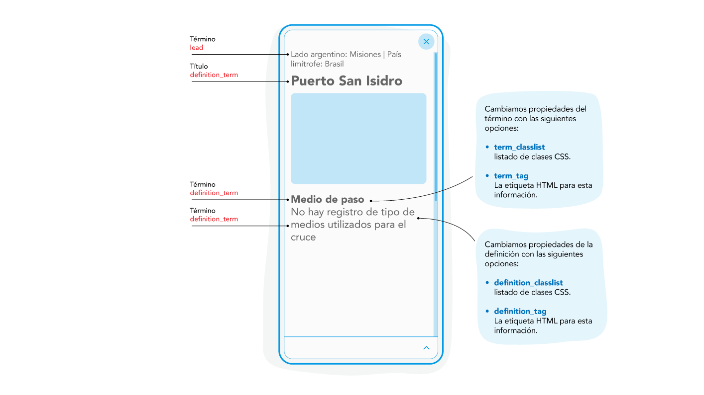
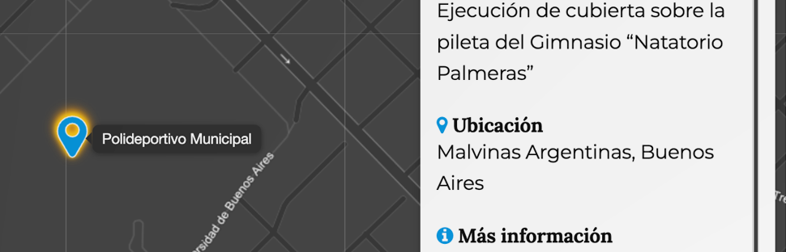

# Template structure

- [Template structure](#template-structure)
  - [Sintaxis](#sintaxis)
  - [Parámetros](#parámetros)
  - [Lead](#lead)
    - [Sintaxis](#sintaxis-1)
    - [Parámetros](#parámetros-1)
  - [Mixing](#mixing)
    - [Sintaxis](#sintaxis-2)
    - [Parámetros](#parámetros-2)
    - [Ejemplo](#ejemplo)
      - [Uso de condicionales en Línea en template](#uso-de-condicionales-en-línea-en-template)


Template structure permite controlar el formato de la información que se presenta en el _slider_ (panel desplegable o tarjeta), o en modo _popup_. Dentro de las opciones que ofrece esta herramienta, se pueden gestionar elementos como: _lead_ (volanta), nombrar o renombrar _headers_ (encabezados), definir un título, agregar o excluir valores de la entrada JSON, especificar el tipo de etiquetas HTML y aplicar estilos, entre otras cosas.

En esta sección, se detalla el uso y el tipo de valor esperado para cada índice, junto con ejemplos de uso.


<div style="border:1px solid #68C3EF; border-radius:8px; overflow:clip">

</div>


## Sintaxis

```js
const options = {
    "template_structure": {
        "lead": [],
        "header": false,
        "title": "",
        "mixing": [],
        "values": [],
        "exclude": [],
        "container_classlist": ["info-container"],
        "title_classlist": ["h4","text-primary","m-t-0"],
        "definition_list_classlist":["definition-list"],
        "term_classlist": ["h6", "m-b-0"],
        "definition_classlist": [],
        "definition_list_tag": "dl",
        "term_tag": "dt",
        "definition_tag": "dd",
    }
}
```
## Parámetros

<table>
  <thead>
    <tr>
      <th>Parámetro</th>
      <th>Tipo</th>
      <th>Default</th>
      <th>Descripción</th>
    </tr>
  </thead>
  <tbody>
    <tr>
      <td>values</td>
      <td><code>Array()</code></td>
      <td><code>[]</code></td>
      <td><p>Permite defini cuales son las claves que deben imprimirse en el slider.</p></td>
    </tr>
    <tr>
      <td>exclude</td>
      <td><code>Array()</code></td>
      <td><code>[]</code></td>
      <td><p>Permite definir cuales son las claves que <b>no</b> deben imprimirse en el slider.</p></td>
    </tr>
    <tr>
      <td>container_classlist</td>
      <td><code>Array()</code></td>
      <td><code>["info-container"]</code></td>
      <td><p>Define la lista de clases CSS que pueden agregarse al contenedor del listado de términos y descripciones.</p></td>
    </tr>
    <tr>
      <td>lead</td>
      <td><code>object</code></td>
      <td><code>{}</code></td>
      <td>
        <p>Volanta.</p>
        <p>Ver opciones para <a href="#lead">lead</a>.</p>
      </td>
    </tr>
    <tr>
      <td>mixing</td>
      <td><code>object</code></td>
      <td><code>{}</code></td>
      <td>
        <p>Permite crear una entrada uniendo cadenas de texto o valores de entrada.</p>
        <p>Ver opciones para <a href="#mixing">mixing</a>.</p>
      </td>
    </tr>
    <tr>
      <td>header</td>
      <td><code>function</code></td>
      <td><code>false</code></td>
      <td>
        <p>Permite modificar el header del template retornando un <code>string</code> desde una función.</p>
        <p><code>"header": (self, entry) => string</code></p>
      </td>
    </tr>
    <tr>
      <td>title</td>
      <td><code>string</code></td>
      <td><code>""</code></td>
      <td><p>Permite redefinir la clave que se utiliza para el panel de información teniendo precedencia sobre la opción general <em><code>title</code></em>.</p></td>
    </tr>
    <tr>
      <td>title_classlist</td>
      <td><code>Array()</code></td>
      <td><code>["h4","title"]</code></td>
      <td><p>Listado de selectores CSS se que aplicarán en la etiqueta HTML asignada a título.</p></td>
    </tr>
    <tr>
      <td>definition_list_classlist</td>
      <td><code>Array()</code></td>
      <td><code>["definition-list"]</code></td>
      <td><p>Listado de selectores CSS se que aplicarán en la etiqueta HTML asignada contenedor del listado de términos y definiciones.</p></td>
    </tr>
    <tr>
      <td>term_classlist</td>
      <td><code>Array()</code></td>
      <td><code>["h6", "m-b-0"]</code></td>
      <td><p>Listado de selectores CSS se que aplicarán en la etiqueta HTML asignada al término.</p></td>
    </tr>
    <tr>
      <td>definition_classlist</td>
      <td><code>Array()</code></td>
      <td><code>[]</code></td>
      <td><p>Listado de selectores CSS se que aplicarán en la etiqueta HTML asignada a la definición.</p></td>
    </tr>
    <tr>
      <td>definition_list_tag</td>
      <td><code>strng</code></td>
      <td><code>dl</code></td>
      <td><p>Define la etiqueta HTML que contiene el listado de términos y descripciones.</p></td>
    </tr>
    <tr>
      <td>term_tag</td>
      <td><code>strng</code></td>
      <td><code>dt</code></td>
      <td><p>Define la etiqueta HTML para el término.</p></td>
    </tr>
    <tr>
      <td>definition_tag</td>
      <td><code>strng</code></td>
      <td><code>dd</code></td>
      <td><p>Define la etiqueta HTML para la descripción.</p></td>
    </tr>
  </tbody>
</table>


## Lead


El lead (o volanta) es un texto breve que se ubica sobre el título principal. Al utilizar la lead dentro de template_structure, se puede modificar su estilo directamente mediante atributos style en línea, o bien, aplicar estilos a través de una definición CSS.

### Sintaxis

```js
"template_structure": {
    "lead": {
        "key": "type", 
        "css": "text-primary bg-warning",
        "style": "color: orange; font-size:2em; margin: 2em auto;"
    }
} 
```

### Parámetros

<table>
  <thead>
    <tr>
      <th>Parámetro</th>
      <th>Tipo</th>
      <th>Default</th>
      <th>Descripción</th>
    </tr>
  </thead>
  <tbody>
    <tr>
      <td>key</td>
      <td><code>string</code></td>
      <td><code>""</code></td>
      <td><p>Clave de la entrada del JSON o del geoJSON <em>feature.properties</em>.</p></td>
    </tr>
    <tr>
      <td>css</td>
      <td><code>string, function</code></td>
      <td><code>""</code></td>
      <td>
        <p><strong>String</strong></p>
        <p>Definición de css, ej: <code>"text-primary bg-warning"</code>.</p>
        <p><strong>Función</strong></p>
        <p><code>css: (self, entry) => string;</code></p>
        <p>Dónde <code>self</code> el la instancia del objeto <em>PonchoMap</em> o <em>PonchoMapFilter</em> y <code>entry</code> corresponde a una entrada o feature del JSON.</p>
      </td>
    </tr>
    <tr>
      <td>style</td>
      <td><code>string, function</code></td>
      <td><code>""</code></td>
      <td>
        <p><strong>String</strong></p>
        <p>Definición para <em>style</em>, ej:<br><code>"color: orange; font-size:2em; margin: 2em auto;"</code>.</p>
        <p><strong>Función</strong></p>
        <p><code>css: (self, entry) => string;</code></p>
        <p>Dónde <code>self</code> el la instancia del objeto <em>PonchoMap</em> o <em><a href="../ponchomap-filter/">PonchoMapFilter</a></em> y <code>entry</code> corresponde a una entrada o feature del JSON.</p>
      </td>
    </tr>
  </tbody>
</table>

## Mixing



Los _mixings_ facilitan la creación de composiciones a partir de información fragmentada presente en una entrada JSON. Permiten combinar valores de diferentes claves para generar una nueva entrada con una clave unificada.

### Sintaxis

```js
"template_structure": {
    "mixing":[
        {
            "template": [boolean|string],
            "key": [string],
            "header": [string],
            "values": [Array],
            "separator": [string]
        },
        ...
    ]
}
```


### Parámetros

| Parámetro | Tipo | Default | Descripción |
|:---|:---|:---|:---|
| template | `string` | false | Permite componer una plantilla HTML con las claves encerradas en doble llave, por ejemplo: `"{{valor}} <strong>{{porcentaje}} %</strong>"`. `valor` y `porcentaje` son ejemplos de claves que corresponden a las propiedades del objeto de datos que se ingrese. | 
| key | `string` | "" | Clave de la entrada del JSON o del geoJSON `feature.properties`. | 
| header | `string` | "" | Nombre que va a tener el campo como título. |
| values | `Array` | [] | Listado de claves ordenados según el orden de aparición. |
| separator | `string` | "" | Carácter o cadena de caracteres con la que se van a concatenar los valores. |


### Ejemplo

Considerando una entrada JSON con información de ubicación distribuida en las claves: calle, numero, localidad y provincia. Mediante un _mixing_, podemos concatenar estos valores en una única clave.


```js
{
    "calle": "Mercedes",
    "numero": "3180",
    "localidad": "Malvinas Argentinas",
    "provincia": "Buenos Aires",
}
```

**La sintaxis para el _mixing_ seria:**

```js
"template_structure": {
    "mixing":[
        {
            "template": false,
            "key": "direccion",
            "header": "Dirección",
            "values": ["calle", "numero", ", ", "localidad", ", ", "provincia"],
            "separator": ""
        },
        ...
    ]
}

// Resultado: Mercedes 3180, Malvinas Argentinas, Buenos Aires
```

Mismo resultado utilizando la clave `template`.

```js
"template_structure": {
    "mixing":[
        {
            "template": "{{calle}} {{numero}}, {{localidad}}, {{provincia}}",
            "key": "direccion",
            "header": "Dirección",
            "values": false,
            "separator": ""
        },
        ...
    ]
}

// Resultado: Mercedes 3180, Malvinas Argentinas, Buenos Aires
```

También puede utilizarse etiquetas html.

```js
"template_structure": {
    "mixing":[
        {
            "template": "<strong>{{calle}} {{numero}}</strong>,<br>{{localidad}},<br>{{provincia}}.", 
            ...
        },
        ...
    ]
}

// Resultado: <strong>Mercedes 3180</strong>,<br>Malvinas Argentinas<br>Buenos Aires.
```

#### Uso de condicionales en Línea en template

La capacidad de aplicar lógica de presentación directamente dentro de una plantilla es fundamental para controlar dinámicamente el formato de salida basándose en el contenido de los datos. Esta funcionalidad se implementa a través de los Condicionales en Línea o "expresiones ternarias" en algunos lenguajes.

**Estructura del Condicional**

El condicional en línea permite evaluar una condición simple y renderizar uno de dos valores posibles según el resultado.

La sintaxis general es la siguiente:

```

```

Donde:

- **[valor-si-verdadero]**: Es el string o la expresión que se renderizará si la [condicion] se cumple (true).
- **[condicion]**: Es la expresión lógica a evaluar, utilizando una [clave-de-la-entrada] y un [operador] de comparación (==, !=) contra el objeto de comparación.
- **[valor-si-falso]**: Es el string o la expresión que se renderizará si la [condicion] no se cumple (false).

**Ejemplo práctico**

Consideremos una entrada de datos en formato JSON y el requisito de asociar un icono visual específico solo a las entidades que pertenecen a una categoría determinada.

**Entrada de datos**

```json
{
    "color": "azul",
    "categoria": "salud",
    "nombre": "Hospital Zubizarreta"
}
```

**Implementación en la estructura de plantilla**

Para que solo se muestre el icono (`<i class="icon-salud"></i>`) cuando la clave categoria sea estrictamente igual a 'salud', el condicional en línea se inserta directamente en la propiedad template de la siguiente manera:

```js
"template_structure": {
    "mixing": [
        {
            "template": ` {{nombre}}`,
            "key": "institucion",
            "header": "Institución",
            "values": false,
            "separator": ""
        },
        // ... otros elementos de mixing
    ]
}
```

**Resultado de la Renderización**

Si categoria es "salud": El resultado renderizado será el icono (con el color dinámico) seguido del valor de nombre.

```html
<i class="icon-salud" style="color: azul"></i> Hospital Zubizarreta.
```

Si categoria es otra cosa (ej. "educacion"): El [valor-si-falso] es una cadena vacía (''), por lo que solo se renderizará el valor de nombre.

```html
Hospital Zubizarreta.
```