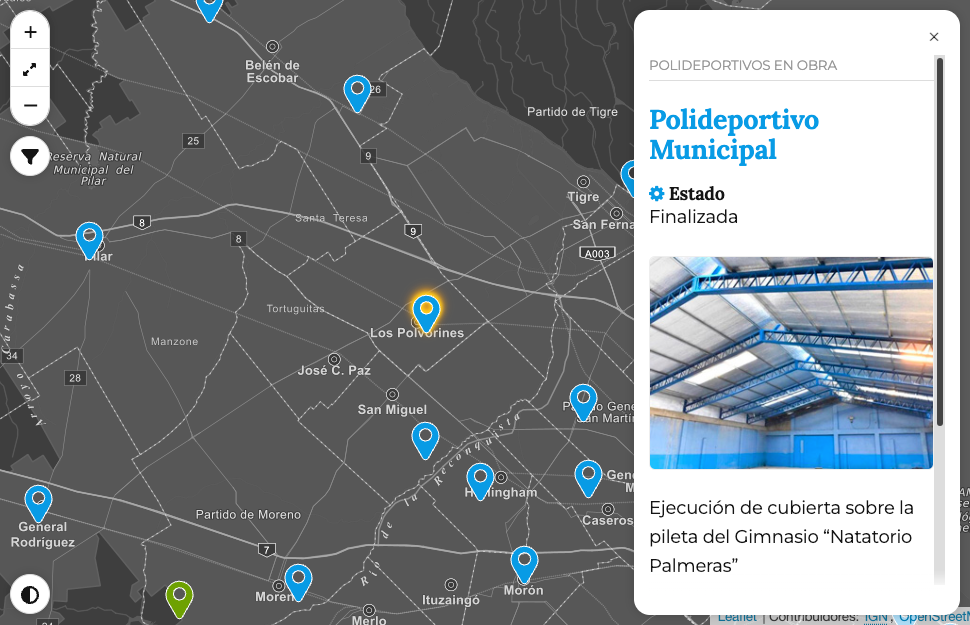

# PonchoMap




## Tabla de contenidos

- [PonchoMap](#ponchomap)
  - [Tabla de contenidos](#tabla-de-contenidos)
  - [Opciones generales](#opciones-generales)
  - [Métodos](#métodos)
    - [PonchoMap](#ponchomap-1)
    - [PonchoMapFilter](#ponchomapfilter)
  - [Modo de uso](#modo-de-uso)
    - [Estructura HTML](#estructura-html)
  - [Referencias](#referencias)


---

## Opciones generales

<table>
  <thead>
    <tr>
      <th style="text-align:left">Parámetro</th>
      <th style="text-align:left">Tipo</th>
      <th style="text-align:left">Default</th>
      <th style="text-align:left">Descripción</th>
    </tr>
  </thead>
  <tbody>
    <tr>
      <td style="text-align:left">allowed_tags</td>
      <td style="text-align:left"><code>object</code></td>
      <td style="text-align:left"><code>[]</code></td>
      <td style="text-align:left">Permite configurar un listado de etiquetas HTML que se imprimirán como parte del DOM y no como un texto. Para habilitar todas las etiquetas se utiliza <code>["*"]</code>. Si se quiere especificar cuales deben usarse, ej.: <code>["a", "strong"]</code>.</td>
    </tr>
    <tr>
      <td style="text-align:left">anchor_delay</td>
      <td style="text-align:left"><code>integer</code></td>
      <td style="text-align:left">0</td>
      <td style="text-align:left">Tiempo de demora entre que se carga la página y se muestra el marker pasado por url. El valor es en milisegundos (1" = 1000).</td>
    </tr>
    <tr>
      <td style="text-align:left">breakpoint</td>
      <td style="text-align:left"><code>Array object</code></td>
      <td style="text-align:left"></td>
      <td style="text-align:left">Definición para tamaño de dispositivos. <code>breakpoint: {lg: 992,xl: 1200,sm: 576,md: 768}</code></td>
    </tr>
    <tr>
      <td style="text-align:left">breakpoint_fraction</td>
      <td style="text-align:left"><code>Array object</code></td>
      <td style="text-align:left"></td>
      <td style="text-align:left">Alineación del mapa según el tamaño del dispositivo. <code>breakpoint_fraction: {sm: "1:4",md: "1:4",lg: "1:3",xl: "2:7"}</code></td>
    </tr>
    <tr>
      <td style="text-align:left">content_selector</td>
      <td style="text-align:left"><code>boolean</code></td>
      <td style="text-align:left"><code>false</code></td>
      <td style="text-align:left">Permite esetablecer un selector alternativo donde se quiera imprimir el contenido.</td>
    </tr>
    <tr>
      <td style="text-align:left">error_reporting</td>
      <td style="text-align:left"><code>boolean</code></td>
      <td style="text-align:left">true</td>
      <td style="text-align:left">Activa la visualización de errores o warnings en el mapa.</td>
    </tr>
    <tr>
      <td style="text-align:left">fit_bounds_onevent</td>
      <td style="text-align:left"><code>boolean</code></td>
      <td style="text-align:left"><code>true</code></td>
      <td style="text-align:left">Realiza un zoom en el polígono, línea o marcador, cuando se utilia el select o por URL.</td>
    </tr>
    <tr>
      <td style="text-align:left">hash</td>
      <td style="text-align:left"><code>boolean</code></td>
      <td style="text-align:left"><code>false</code></td>
      <td style="text-align:left">Habilita la acción por la cual, cada vez que se hace <em>clic</em> en un marker se reemplaza el hash en la barra de dirección del navegador.</td>
    </tr>
    <tr>
      <td style="text-align:left">header_icons</td>
      <td style="text-align:left"><code>object</code></td>
      <td style="text-align:left"><code>{}</code></td>
      <td style="text-align:left">Permite definir un ícono para cada uno de los headers de la entrada.<br><br> <a href="#opciones-para-header_icons">Ver opciones para header_icons</a>.</td>
    </tr>
    <tr>
      <td style="text-align:left">headers</td>
      <td style="text-align:left"><code>object</code></td>
      <td style="text-align:left"><code>{}</code></td>
      <td style="text-align:left">Permite definir títulos dinámicos mapeando la clave del objeto que contiene la información con los encabezados</td>
    </tr>
    <tr>
      <td style="text-align:left">id</td>
      <td style="text-align:left"><code>string</code></td>
      <td style="text-align:left">id</td>
      <td style="text-align:left">Nombre de la columna donde se encuentra el id. Si la fuente de datos usa otro nombre se define con esta opción. Ej. <code>"id":"id_punto_digital"</code>.</td>
    </tr>
    <tr>
      <td style="text-align:left">id_mixing</td>
      <td style="text-align:left"><code>object</code></td>
      <td style="text-align:left"><code>[]</code></td>
      <td style="text-align:left">Permite definir cómo se llamará el identificador de un macador, polígono o línea del mapa, concatenando índices o cadenas de texto en un <em>array</em>. Por ejemplo: <code>["id", "cadena-de-texto", "name"]</code>. <br><br>El orden de los elementos depende del criterio de quien lo arma y, las cadenas de texto pasan por un filtro que los convierte en <a href="https://es.wikipedia.org/wiki/Slug">slug</a>.</td>
    </tr>
    <tr>
      <td style="text-align:left">latitud</td>
      <td style="text-align:left"><code>string</code></td>
      <td style="text-align:left">latitud</td>
      <td style="text-align:left">Nombre de la columna con el valor de latitud. Si la fuente de datos usa otro nombre se define con esta opción. Ej. <code>"latitud":"lat"</code>.</td>
    </tr>
    <tr>
      <td style="text-align:left">longitud</td>
      <td style="text-align:left"><code>string</code></td>
      <td style="text-align:left">longitud</td>
      <td style="text-align:left">Nombre de la columna con el valor de longitud. Si la fuente de datos usa otro nombre se define con esta opción. Ej. <code>"longitud":"lng"</code>.</td>
    </tr>
    <tr>
      <td style="text-align:left">map_align</td>
      <td style="text-align:left"><code>string</code></td>
      <td style="text-align:left"><code>center</code></td>
      <td style="text-align:left">Permite alinear el mapa a la izquierda o a la derecha de su contenedor. Opciones: <em>«left»</em> o <em>«right»</em>.</td>
    </tr>
    <tr>
      <td style="text-align:left">map_anchor_zoom</td>
      <td style="text-align:left"><code>integer</code></td>
      <td style="text-align:left">16</td>
      <td style="text-align:left">Configuración del zoom para los markers que se deben visualizar pasándo por hash el id del marker.</td>
    </tr>
    <tr>
      <td style="text-align:left">map_background</td>
      <td style="text-align:left"><code>string</code></td>
      <td style="text-align:left"><code>#DDD</code></td>
      <td style="text-align:left">Permite definir un color de fondo para el mapa.<br><br>Junto a <code>map_opacity</code>, puede resulter de un uso interesante.</td>
    </tr>
    <tr>
      <td style="text-align:left">map_layers</td>
      <td style="text-align:left"><code>boolean</code></td>
      <td style="text-align:left"><code>true</code></td>
      <td style="text-align:left">Habilita o deshabilita la opción para visualizar el mapa en vista satelital o mapa por defecto.</td>
    </tr>
    <tr>
      <td style="text-align:left">map_layers_default</td>
      <td style="text-align:left"><code>string</code></td>
      <td style="text-align:left"><code>map</code></td>
      <td style="text-align:left">Permite iniciar el mapa en una de las visstas disponibles: <em>satelital</em> o <em>map</em>.</td>
    </tr>
    <tr>
      <td style="text-align:left">map_opacity</td>
      <td style="text-align:left"><code>float</code></td>
      <td style="text-align:left">1</td>
      <td style="text-align:left">Permite transparentar los mozaicos (<em>tiles</em>, del inglés), que componen el mapa. El rango es de 0 a 1. Por ejémplo: <code>map_opacity: 0.5</code></td>
    </tr>
    <tr>
      <td style="text-align:left">map_selector</td>
      <td style="text-align:left"><code>string</code></td>
      <td style="text-align:left">map</td>
      <td style="text-align:left">Nombre del id que utiliza Leaflet para hacer el <em>render</em> del mapa.</td>
    </tr>
    <tr>
      <td style="text-align:left">map_view</td>
      <td style="text-align:left"><code>Array Object</code></td>
      <td style="text-align:left"><code>[-40.44, -63.59]</code></td>
      <td style="text-align:left">Geoposicionamiento inicial del mapa.</td>
    </tr>
    <tr>
      <td style="text-align:left">map_zoom</td>
      <td style="text-align:left"><code>integer</code></td>
      <td style="text-align:left">4</td>
      <td style="text-align:left">Configuración del valor inicial para el zoom del mapa.</td>
    </tr>
    <tr>
      <td style="text-align:left">marker</td>
      <td style="text-align:left"><code>string, function</code></td>
      <td style="text-align:left">azul</td>
      <td style="text-align:left"><p>Permite asignar un color distinto o usar una función para cambiar la lógica en la que se muestran los colores o usar iconos de otro tipo.</p><p> <a href="#opciones-para-marker">Ver opciones para marker</a>.</p></td>
    </tr>
    <tr>
      <td style="text-align:left">marker_cluster_options</td>
      <td style="text-align:left"><code>Object</code></td>
      <td style="text-align:left"><code>"marker_cluster_options": {}</code></td>
      <td style="text-align:left"> <a href="#opciones-para-marker_cluster_options">Ver opciones para marker_cluster_options</a></td>
    </tr>
    <tr>
      <td style="text-align:left">markdown_options</td>
      <td style="text-align:left"><code>object</code></td>
      <td style="text-align:left"></td>
      <td style="text-align:left">Permite configurar las opciones del <em>plugin</em> showdown.js<br><br><a href="#opciones-para-markdown_options">Ver opciones para markdown_options</a></td>
    </tr>
    <tr>
      <td style="text-align:left">no_info</td>
      <td style="text-align:left"><code>boolean</code></td>
      <td style="text-align:left"><code>false</code></td>
      <td style="text-align:left">Permite deshabilitar la información del marker. Cuando esta opción está en false, no se despliega el popUp o el slider.</td>
    </tr>
    <tr>
      <td style="text-align:left">open_maps</td>
      <td style="text-align:left"><code>boolean</code></td>
      <td style="text-align:left"><code>false</code></td>
      <td style="text-align:left"><p>Habilita el menú de enlaces alternativos.</p><p><a href="#open-maps">Ver open maps</a></p></td>
    </tr>
    <tr>
      <td style="text-align:left">open_maps_options</td>
      <td style="text-align:left"><code>object</code></td>
      <td style="text-align:left"></td>
      <td style="text-align:left"><p>Permite redefinir el nombre del desplegable y los enlaces a mapas externos.</p><p><a href="#opciones-para-open_maps_options">Ver opciones para open_maps_options</a></p></td>
    </tr>
    <tr>
      <td style="text-align:left">render_slider</td>
      <td style="text-align:left"><code>boolean</code></td>
      <td style="text-align:left"><code>true</code></td>
      <td style="text-align:left">Permite que se cree el componente <em>slider</em> en el mapa.</td>
    </tr>
    <tr>
      <td style="text-align:left">reset_zoom</td>
      <td style="text-align:left"><code>boolean</code></td>
      <td style="text-align:left"><code>false</code></td>
      <td style="text-align:left">Habilita el un botón en medio del botón <em>zoom-out</em> y <em>zoom-in</em> para mostrar el mapa completo con sus <em>markers</em>.</td>
    </tr>
    <tr>
      <td style="text-align:left">scope</td>
      <td style="text-align:left"><code>string</code></td>
      <td style="text-align:left"><em><code>empty string</code></em></td>
      <td style="text-align:left">Es el ambiente de trabajo sobre un mapa en particular. Cuando se utiliza más de un mapa en la página esto sirve para diferenciarlos.</td>
    </tr>
    <tr>
      <td style="text-align:left">scroll</td>
      <td style="text-align:left"><code>boolean</code></td>
      <td style="text-align:left"><code>false</code></td>
      <td style="text-align:left">Hace un scroll para posisionar la página en el borde superior del mapa cuando se carga la página.</td>
    </tr>
    <tr>
      <td style="text-align:left">slider</td>
      <td style="text-align:left"><code>boolean</code></td>
      <td style="text-align:left"><code>false</code></td>
      <td style="text-align:left">Habilita el slider y reemplaza el popUp.</td>
    </tr>
    <tr>
      <td style="text-align:left">slider_size</td>
      <td style="text-align:left"><code>string\|false</code></td>
      <td style="text-align:left"><code>false</code></td>
      <td style="text-align:left"><p>Opciones:</p>
          <dl>
    <dt>large</dt>
    <dd>Tarjeta con ancho al 50&nbsp;%.</dd>
    <dt>default</dt>
    <dd>Tarjeta con tamaño por defecto (30&nbsp;% aprox).</dd>
    </dl> </td>
    </tr>
    <tr>
      <td style="text-align:left">summary</td>
      <td style="text-align:left"><code>string|object</code></td>
      <td style="text-align:left"></td>
      <td style="text-align:left"><p>Agrega una descripción o propósito del mapa. El sumario puede estar oculto, pero «visible» para lectores de pantalla o se le puede dar formato usando las opciones: css o style.</p> 
      <div>
      <code>summary: "cadena de texto"</code>
      </div> o <div>
<pre><code>
summary: {
    title: "Cadena de texto", 
    hidden: "boolean",css:"object|string", 
    style: "object|string", 
    position: "top|bottom" 
}</code></pre>
      </div> 
      <p><a href="#opciones-para-summary">Ver opciones para <em>summary</em></a>.</p>
      </td>
    </tr>
    <tr>
      <td style="text-align:left">template</td>
      <td style="text-align:left"><code>object</code></td>
      <td style="text-align:left"><code>null</code></td>
      <td style="text-align:left">Define la función que controla el template para el popUp o el slider.<br><br> <a href="#opciones-para-templates">Ver opciones para template</a>.</td>
    </tr>
    <tr>
      <td style="text-align:left">template_innerhtml</td>
      <td style="text-align:left"><code>boolean</code></td>
      <td style="text-align:left"><code>false</code></td>
      <td style="text-align:left">Permite incrustar html dentro de la descripción.</td>
    </tr>
    <tr>
      <td style="text-align:left">template_markdown</td>
      <td style="text-align:left"><code>boolean</code></td>
      <td style="text-align:left"><code>false</code></td>
      <td style="text-align:left">Habilita el uso del <em>plugin</em> <a href="https://showdownjs.com">showdown.js</a>.</td>
    </tr>
    <tr>
      <td style="text-align:left">template_structure</td>
      <td style="text-align:left"><code>object</code></td>
      <td style="text-align:left"><code>{}</code></td>
      <td style="text-align:left">Permite definir un listado de valores a mostarar en el template por defecto o excluir valores que no se deseen mostrar. <br><br> <a href="#opciones-para-template_structure">Ver opciones para template_structure</a>.</td>
    </tr>
    <tr>
      <td style="text-align:left">theme</td>
      <td style="text-align:left"><code>string</code></td>
      <td style="text-align:left"><code>default</code></td>
      <td style="text-align:left">Permite cambiar el tema de la interfase y el mapa. Las opciones disponibles son:<br>  <ul><li><em>default</em>, Original</li><li><em>contrast</em>, Alto contraste</li><li><em>dark</em>, Oscuro</li><li><em>grayscale</em>, Gris</li><li><em>sepia</em>, Sepia</li><li><em>blue</em>, Azul</li><li><em>relax</em>, Relax</li><li><em>transparent</em>, Transparente</li></ul></td>
    </tr>
    <tr>
      <td style="text-align:left">theme_map</td>
      <td style="text-align:left"><code>string</code></td>
      <td style="text-align:left"><code>default</code></td>
      <td style="text-align:left">Permite definir un tema de color para el mapa.</td>
    </tr>
    <tr>
      <td style="text-align:left">theme_tool</td>
      <td style="text-align:left"><code>boolean</code></td>
      <td style="text-align:left"><code>true</code></td>
      <td style="text-align:left">Permite remover la herramienta de temas para el usuario.</td>
    </tr>
    <tr>
      <td style="text-align:left">theme_ui</td>
      <td style="text-align:left"><code>string</code></td>
      <td style="text-align:left"><code>default</code></td>
      <td style="text-align:left">Permite definir un tema de color para la interfase del mapa.</td>
    </tr>
  </tbody>
</table>

----

## Métodos

### PonchoMap

| Método | Retrono | Descripción |
|:--|:--|:--|
| entry | `object` | Retrona una entrada pasándo su id por parámetro. |
| selected_marker | `object` | Retorna el último marker seleccionado en un objeto con dos índices; el primero es la entrada asignada al *marker* y el segundo es la instancia *leaflet* de ese *marker*  |
| resetView | `void` | Restablece la posición y el zoom del mapa y los *markers* a su posición inicial por defecto. |
| hasHash | boolean:false \| string | Retorna el identificador del *marker* pasado por URL. |
| gotoEntry | `void` | Retorna el identificador del *marker* pasado por URL. |
| gotoHashedEntry | `void` | Obtiene el hash desde la url y hace zoom sobre el marker con ese identificador. Según la configuración puede abrir un popUp o el slider. |
| entries | `object` | Objeto con las entradas iniciales, sin filtrar o procesar. |
| map | `object` | Objeto map de leaflet. |
| markers | `object` | Objeto markers de leaflet. |

### PonchoMapFilter

| Método | Retrono | Descripción |
|:--|:--|:--|
| filteredEntries | `object` | Objeto con las entradas filtradas. |
| totals | `object` | Retorna la cantidad de markers por cada uno de los filtros. Asi como retorna los totales también la posición del filtro. |
| formFilters | `object` | Retorna los filtros marcados. Los datos de retorno son: el grupo de filtro y el índice en el grupo. |


## Modo de uso

### Estructura HTML

Lo conveniente es tener la asignación de documentos CSS dentro de la etiqueta `<head>` y la llamada a los documentos JavaScript inmediatamente antes del cierre del body (`</body>`).

```html
<link href="https://mapa-ign.argentina.gob.ar/js/leaflet/leaflet.css" rel="stylesheet"/>
```

```html
<!-- PONCHO MAP SCRIPTS -->
<script src="https://mapa-ign.argentina.gob.ar/js/leaflet/leaflet.js"></script>
<script src="https://mapa-ign.argentina.gob.ar/js/leaflet/leaflet.markercluster.js"></script>
<script src="https://www.argentina.gob.ar/profiles/argentinagobar/themes/contrib/poncho/js/poncho.min.js"></script>
<!-- / PONCHO MAP SCRIPTS -->
```

*CLUSTERS*

**JS**

```html
<script src="https://mapa-ign.argentina.gob.ar/js/leaflet/leaflet.markercluster.js"></script>
```

**CSS**

```html
<link href="https://mapa-ign.argentina.gob.ar/js/leaflet/MarkerCluster.css" rel="stylesheet"/>
<link href="https://mapa-ign.argentina.gob.ar/js/leaflet/MarkerCluster.Default.css" rel="stylesheet"/>
```

*SHOWDOWN*

```html
<script src="https://www.argentina.gob.ar/sites/default/files/ponchotable/showdown.js"></script>
<script src="https://www.argentina.gob.ar/profiles/argentinagobar/themes/argentinagobar/argentinagobar_theme/js/extensiones/showdown-extensions.js"></script>
```


Si se desea utilizar el buscador debe incluirse el siguiente código. El código puede ubicarse en el lugar de la página donde sea más conveniente. 

```html
<!-- PONCHO MAP SEARCH -->
<search>
    <form>
        <div data-scope="search-poncho-map">
            <label class="sr-only" for="search">Buscar puntos</label>
            <div class="input-group m-b-0 p-b-0 webform-component">
                <input 
                    class="js-poncho-map-search__input form-control" 
                    id="search" 
                    list="js-porcho-map-search__list" 
                    name="search" 
                    autocomplete="true"
                    spellcheck="true" 
                    type="search"> 
                <datalist 
                    class="js-porcho-map-search__list" 
                    id="js-porcho-map-search__list">
                </datalist> 
                <span class="input-group-btn">
                    <button 
                        class="js-poncho-map-search__submit btn btn-primary" 
                        type="submit">
                        <i class="fa fa-search text-white"></i>
                        <span class="sr-only">Buscar término</span>
                    </button> 
                </span>
            </div>
            <div data-scope="ponchomap">
                <div class="js-poncho-map__help text-mutted small"></div>
            </div>
        </div>
    </form>
</search>
<!-- / PONCHO MAP SEARCH -->
```

Para que se imprima el mapa con todas las opciones de PonchoMap se debe incluir el siguiente código.  Pueden agregarse atributos, pero  `data-scope=""` y la clase `poncho-map` deben estar presentes.

```html
<!-- PONCHO MAP -->
<div class="poncho-map" data-scope="poncho-map-scope">
    <div
        class="leaflet-container leaflet-touch leaflet-fade-anim 
              leaflet-grab leaflet-touch-drag leaflet-touch-zoom"
        id="map"
        style="height: 600px; width: 100%;">
    </div>
</div>
<!-- / PONCHO MAP -->
```

Por último agregamos la llamada al mapa.

```js
<script>
  // init
  (async() => {
      // fetch data
      const url = "[URL endpoint]";
      const sheet_data = await fetch_json(url); 
      // render map
      const options = {
          "template": template,
          "scope": "poncho-map"
      };
      const mapa = new PonchoMapFilter(sheet_data, options);
      mapa.render();
  })();
</script>
```

## Referencias
1. Leaftlet <[https://leafletjs.com/](https://leafletjs.com/)>