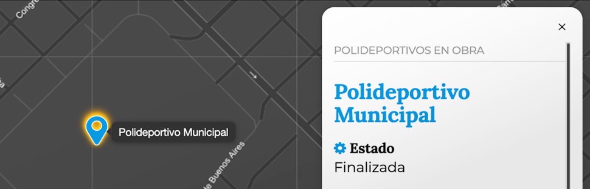
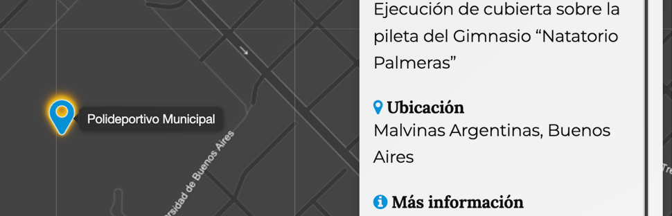

# PonchoMap


## Tabla de contenidos

- [PonchoMap](#ponchomap)
  - [Tabla de contenidos](#tabla-de-contenidos)
  - [Opciones generales](#opciones-generales)
    - [Opciones para summary](#opciones-para-summary)
      - [Parámetros](#parámetros)
  - [Opciones para template\_structure](#opciones-para-template_structure)
    - [Sintaxis](#sintaxis)
    - [Parámetros](#parámetros-1)
    - [Opciones para Lead](#opciones-para-lead)
      - [Sintaxis](#sintaxis-1)
      - [Parámetros](#parámetros-2)
    - [Opciones para mixing](#opciones-para-mixing)
      - [Uso de condicionales en Línea en template](#uso-de-condicionales-en-línea-en-template)
      - [Parámetros](#parámetros-3)
    - [Opciones para header\_icons](#opciones-para-header_icons)
    - [Opciones para marker](#opciones-para-marker)
      - [Definiendo colores](#definiendo-colores)
      - [Modificando el tipo de marker](#modificando-el-tipo-de-marker)
    - [Opciones para template](#opciones-para-template)
      - [Ejemplos](#ejemplos)
        - [Función dentro y fuera del grupo de opciones](#función-dentro-y-fuera-del-grupo-de-opciones)
        - [Modificando la entrada y retornando el template por defecto](#modificando-la-entrada-y-retornando-el-template-por-defecto)
    - [Headers](#headers)
    - [Opciones para marker\_cluster\_options](#opciones-para-marker_cluster_options)
      - [Valores por defecto](#valores-por-defecto)
    - [Opciones para markdown\_options](#opciones-para-markdown_options)
      - [Valores por defecto](#valores-por-defecto-1)
    - [Open maps](#open-maps)
    - [Opciones para open\_maps\_options](#opciones-para-open_maps_options)
  - [Opciones para PonchoMapFilter](#opciones-para-ponchomapfilter)
    - [Opciones para filters](#opciones-para-filters)
      - [Opciones para field](#opciones-para-field)
      - [Opciones para fields](#opciones-para-fields)
  - [Opciones para PonchoMapSearch](#opciones-para-ponchomapsearch)
      - [Ejemplo de uso para el buscador](#ejemplo-de-uso-para-el-buscador)
  - [Métodos](#métodos)
    - [PonchoMap](#ponchomap-1)
    - [PonchoMapFilter](#ponchomapfilter)
  - [Modo de uso](#modo-de-uso)
    - [Estructura HTML](#estructura-html)
  - [Referencias](#referencias)


---


## Opciones generales

<table>
  <thead>
    <tr>
      <th style="text-align:left">Parámetro</th>
      <th style="text-align:left">Tipo</th>
      <th style="text-align:left">Default</th>
      <th style="text-align:left">Descripción</th>
    </tr>
  </thead>
  <tbody>
    <tr>
      <td style="text-align:left">allowed_tags</td>
      <td style="text-align:left"><code>object</code></td>
      <td style="text-align:left"><code>[]</code></td>
      <td style="text-align:left">Permite configurar un listado de etiquetas HTML que se imprimirán como parte del DOM y no como un texto. Para habilitar todas las etiquetas se utiliza <code>["*"]</code>. Si se quiere especificar cuales deben usarse, ej.: <code>["a", "strong"]</code>.</td>
    </tr>
    <tr>
      <td style="text-align:left">anchor_delay</td>
      <td style="text-align:left"><code>integer</code></td>
      <td style="text-align:left">0</td>
      <td style="text-align:left">Tiempo de demora entre que se carga la página y se muestra el marker pasado por url. El valor es en milisegundos (1" = 1000).</td>
    </tr>
    <tr>
      <td style="text-align:left">breakpoint</td>
      <td style="text-align:left"><code>Array object</code></td>
      <td style="text-align:left"></td>
      <td style="text-align:left">Definición para tamaño de dispositivos. <code>breakpoint: {lg: 992,xl: 1200,sm: 576,md: 768}</code></td>
    </tr>
    <tr>
      <td style="text-align:left">breakpoint_fraction</td>
      <td style="text-align:left"><code>Array object</code></td>
      <td style="text-align:left"></td>
      <td style="text-align:left">Alineación del mapa según el tamaño del dispositivo. <code>breakpoint_fraction: {sm: "1:4",md: "1:4",lg: "1:3",xl: "2:7"}</code></td>
    </tr>
    <tr>
      <td style="text-align:left">content_selector</td>
      <td style="text-align:left"><code>boolean</code></td>
      <td style="text-align:left"><code>false</code></td>
      <td style="text-align:left">Permite esetablecer un selector alternativo donde se quiera imprimir el contenido.</td>
    </tr>
    <tr>
      <td style="text-align:left">error_reporting</td>
      <td style="text-align:left"><code>boolean</code></td>
      <td style="text-align:left">true</td>
      <td style="text-align:left">Activa la visualización de errores o warnings en el mapa.</td>
    </tr>
    <tr>
      <td style="text-align:left">fit_bounds_onevent</td>
      <td style="text-align:left"><code>boolean</code></td>
      <td style="text-align:left"><code>true</code></td>
      <td style="text-align:left">Realiza un zoom en el polígono, línea o marcador, cuando se utilia el select o por URL.</td>
    </tr>
    <tr>
      <td style="text-align:left">hash</td>
      <td style="text-align:left"><code>boolean</code></td>
      <td style="text-align:left"><code>false</code></td>
      <td style="text-align:left">Habilita la acción por la cual, cada vez que se hace <em>clic</em> en un marker se reemplaza el hash en la barra de dirección del navegador.</td>
    </tr>
    <tr>
      <td style="text-align:left">header_icons</td>
      <td style="text-align:left"><code>object</code></td>
      <td style="text-align:left"><code>{}</code></td>
      <td style="text-align:left">Permite definir un ícono para cada uno de los headers de la entrada.<br><br> <a href="#opciones-para-header_icons">Ver opciones para header_icons</a>.</td>
    </tr>
    <tr>
      <td style="text-align:left">headers</td>
      <td style="text-align:left"><code>object</code></td>
      <td style="text-align:left"><code>{}</code></td>
      <td style="text-align:left">Permite definir títulos dinámicos mapeando la clave del objeto que contiene la información con los encabezados</td>
    </tr>
    <tr>
      <td style="text-align:left">id</td>
      <td style="text-align:left"><code>string</code></td>
      <td style="text-align:left">id</td>
      <td style="text-align:left">Nombre de la columna donde se encuentra el id. Si la fuente de datos usa otro nombre se define con esta opción. Ej. <code>"id":"id_punto_digital"</code>.</td>
    </tr>
    <tr>
      <td style="text-align:left">id_mixing</td>
      <td style="text-align:left"><code>object</code></td>
      <td style="text-align:left"><code>[]</code></td>
      <td style="text-align:left">Permite definir cómo se llamará el identificador de un macador, polígono o línea del mapa, concatenando índices o cadenas de texto en un <em>array</em>. Por ejemplo: <code>["id", "cadena-de-texto", "name"]</code>. <br><br>El orden de los elementos depende del criterio de quien lo arma y, las cadenas de texto pasan por un filtro que los convierte en <a href="https://es.wikipedia.org/wiki/Slug">slug</a>.</td>
    </tr>
    <tr>
      <td style="text-align:left">latitud</td>
      <td style="text-align:left"><code>string</code></td>
      <td style="text-align:left">latitud</td>
      <td style="text-align:left">Nombre de la columna con el valor de latitud. Si la fuente de datos usa otro nombre se define con esta opción. Ej. <code>"latitud":"lat"</code>.</td>
    </tr>
    <tr>
      <td style="text-align:left">longitud</td>
      <td style="text-align:left"><code>string</code></td>
      <td style="text-align:left">longitud</td>
      <td style="text-align:left">Nombre de la columna con el valor de longitud. Si la fuente de datos usa otro nombre se define con esta opción. Ej. <code>"longitud":"lng"</code>.</td>
    </tr>
    <tr>
      <td style="text-align:left">map_align</td>
      <td style="text-align:left"><code>string</code></td>
      <td style="text-align:left"><code>center</code></td>
      <td style="text-align:left">Permite alinear el mapa a la izquierda o a la derecha de su contenedor. Opciones: <em>«left»</em> o <em>«right»</em>.</td>
    </tr>
    <tr>
      <td style="text-align:left">map_anchor_zoom</td>
      <td style="text-align:left"><code>integer</code></td>
      <td style="text-align:left">16</td>
      <td style="text-align:left">Configuración del zoom para los markers que se deben visualizar pasándo por hash el id del marker.</td>
    </tr>
    <tr>
      <td style="text-align:left">map_background</td>
      <td style="text-align:left"><code>string</code></td>
      <td style="text-align:left"><code>#DDD</code></td>
      <td style="text-align:left">Permite definir un color de fondo para el mapa.<br><br>Junto a <code>map_opacity</code>, puede resulter de un uso interesante.</td>
    </tr>
    <tr>
      <td style="text-align:left">map_layers</td>
      <td style="text-align:left"><code>boolean</code></td>
      <td style="text-align:left"><code>true</code></td>
      <td style="text-align:left">Habilita o deshabilita la opción para visualizar el mapa en vista satelital o mapa por defecto.</td>
    </tr>
    <tr>
      <td style="text-align:left">map_layers_default</td>
      <td style="text-align:left"><code>string</code></td>
      <td style="text-align:left"><code>map</code></td>
      <td style="text-align:left">Permite iniciar el mapa en una de las visstas disponibles: <em>satelital</em> o <em>map</em>.</td>
    </tr>
    <tr>
      <td style="text-align:left">map_opacity</td>
      <td style="text-align:left"><code>float</code></td>
      <td style="text-align:left">1</td>
      <td style="text-align:left">Permite transparentar los mozaicos (<em>tiles</em>, del inglés), que componen el mapa. El rango es de 0 a 1. Por ejémplo: <code>map_opacity: 0.5</code></td>
    </tr>
    <tr>
      <td style="text-align:left">map_selector</td>
      <td style="text-align:left"><code>string</code></td>
      <td style="text-align:left">map</td>
      <td style="text-align:left">Nombre del id que utiliza Leaflet para hacer el <em>render</em> del mapa.</td>
    </tr>
    <tr>
      <td style="text-align:left">map_view</td>
      <td style="text-align:left"><code>Array Object</code></td>
      <td style="text-align:left"><code>[-40.44, -63.59]</code></td>
      <td style="text-align:left">Geoposicionamiento inicial del mapa.</td>
    </tr>
    <tr>
      <td style="text-align:left">map_zoom</td>
      <td style="text-align:left"><code>integer</code></td>
      <td style="text-align:left">4</td>
      <td style="text-align:left">Configuración del valor inicial para el zoom del mapa.</td>
    </tr>
    <tr>
      <td style="text-align:left">marker</td>
      <td style="text-align:left"><code>string, function</code></td>
      <td style="text-align:left">azul</td>
      <td style="text-align:left"><p>Permite asignar un color distinto o usar una función para cambiar la lógica en la que se muestran los colores o usar iconos de otro tipo.</p><p> <a href="#opciones-para-marker">Ver opciones para marker</a>.</p></td>
    </tr>
    <tr>
      <td style="text-align:left">marker_cluster_options</td>
      <td style="text-align:left"><code>Object</code></td>
      <td style="text-align:left"><code>"marker_cluster_options": {}</code></td>
      <td style="text-align:left"> <a href="#opciones-para-marker_cluster_options">Ver opciones para marker_cluster_options</a></td>
    </tr>
    <tr>
      <td style="text-align:left">markdown_options</td>
      <td style="text-align:left"><code>object</code></td>
      <td style="text-align:left"></td>
      <td style="text-align:left">Permite configurar las opciones del <em>plugin</em> showdown.js<br><br><a href="#opciones-para-markdown_options">Ver opciones para markdown_options</a></td>
    </tr>
    <tr>
      <td style="text-align:left">no_info</td>
      <td style="text-align:left"><code>boolean</code></td>
      <td style="text-align:left"><code>false</code></td>
      <td style="text-align:left">Permite deshabilitar la información del marker. Cuando esta opción está en false, no se despliega el popUp o el slider.</td>
    </tr>
    <tr>
      <td style="text-align:left">open_maps</td>
      <td style="text-align:left"><code>boolean</code></td>
      <td style="text-align:left"><code>false</code></td>
      <td style="text-align:left"><p>Habilita el menú de enlaces alternativos.</p><p><a href="#open-maps">Ver open maps</a></p></td>
    </tr>
    <tr>
      <td style="text-align:left">open_maps_options</td>
      <td style="text-align:left"><code>object</code></td>
      <td style="text-align:left"></td>
      <td style="text-align:left"><p>Permite redefinir el nombre del desplegable y los enlaces a mapas externos.</p><p><a href="#opciones-para-open_maps_options">Ver opciones para open_maps_options</a></p></td>
    </tr>
    <tr>
      <td style="text-align:left">render_slider</td>
      <td style="text-align:left"><code>boolean</code></td>
      <td style="text-align:left"><code>true</code></td>
      <td style="text-align:left">Permite que se cree el componente <em>slider</em> en el mapa.</td>
    </tr>
    <tr>
      <td style="text-align:left">reset_zoom</td>
      <td style="text-align:left"><code>boolean</code></td>
      <td style="text-align:left"><code>false</code></td>
      <td style="text-align:left">Habilita el un botón en medio del botón <em>zoom-out</em> y <em>zoom-in</em> para mostrar el mapa completo con sus <em>markers</em>.</td>
    </tr>
    <tr>
      <td style="text-align:left">scope</td>
      <td style="text-align:left"><code>string</code></td>
      <td style="text-align:left"><em><code>empty string</code></em></td>
      <td style="text-align:left">Es el ambiente de trabajo sobre un mapa en particular. Cuando se utiliza más de un mapa en la página esto sirve para diferenciarlos.</td>
    </tr>
    <tr>
      <td style="text-align:left">scroll</td>
      <td style="text-align:left"><code>boolean</code></td>
      <td style="text-align:left"><code>false</code></td>
      <td style="text-align:left">Hace un scroll para posisionar la página en el borde superior del mapa cuando se carga la página.</td>
    </tr>
    <tr>
      <td style="text-align:left">slider</td>
      <td style="text-align:left"><code>boolean</code></td>
      <td style="text-align:left"><code>false</code></td>
      <td style="text-align:left">Habilita el slider y reemplaza el popUp.</td>
    </tr>
    <tr>
      <td style="text-align:left">slider_size</td>
      <td style="text-align:left"><code>string\|false</code></td>
      <td style="text-align:left"><code>false</code></td>
      <td style="text-align:left"><p>Opciones:</p>
          <dl>
    <dt>large</dt>
    <dd>Tarjeta con ancho al 50&nbsp;%.</dd>
    <dt>default</dt>
    <dd>Tarjeta con tamaño por defecto (30&nbsp;% aprox).</dd>
    </dl> </td>
    </tr>
    <tr>
      <td style="text-align:left">summary</td>
      <td style="text-align:left"><code>string|object</code></td>
      <td style="text-align:left"></td>
      <td style="text-align:left"><p>Agrega una descripción o propósito del mapa. El sumario puede estar oculto, pero «visible» para lectores de pantalla o se le puede dar formato usando las opciones: css o style.</p> 
      <div>
      <code>summary: "cadena de texto"</code>
      </div> o <div>
<pre><code>
summary: {
    title: "Cadena de texto", 
    hidden: "boolean",css:"object|string", 
    style: "object|string", 
    position: "top|bottom" 
}</code></pre>
      </div> 
      <p><a href="#opciones-para-summary">Ver opciones para <em>summary</em></a>.</p>
      </td>
    </tr>
    <tr>
      <td style="text-align:left">template</td>
      <td style="text-align:left"><code>object</code></td>
      <td style="text-align:left"><code>null</code></td>
      <td style="text-align:left">Define la función que controla el template para el popUp o el slider.<br><br> <a href="#opciones-para-templates">Ver opciones para template</a>.</td>
    </tr>
    <tr>
      <td style="text-align:left">template_innerhtml</td>
      <td style="text-align:left"><code>boolean</code></td>
      <td style="text-align:left"><code>false</code></td>
      <td style="text-align:left">Permite incrustar html dentro de la descripción.</td>
    </tr>
    <tr>
      <td style="text-align:left">template_markdown</td>
      <td style="text-align:left"><code>boolean</code></td>
      <td style="text-align:left"><code>false</code></td>
      <td style="text-align:left">Habilita el uso del <em>plugin</em> <a href="https://showdownjs.com">showdown.js</a>.</td>
    </tr>
    <tr>
      <td style="text-align:left">template_structure</td>
      <td style="text-align:left"><code>object</code></td>
      <td style="text-align:left"><code>{}</code></td>
      <td style="text-align:left">Permite definir un listado de valores a mostarar en el template por defecto o excluir valores que no se deseen mostrar. <br><br> <a href="#opciones-para-template_structure">Ver opciones para template_structure</a>.</td>
    </tr>
    <tr>
      <td style="text-align:left">theme</td>
      <td style="text-align:left"><code>string</code></td>
      <td style="text-align:left"><code>default</code></td>
      <td style="text-align:left">Permite cambiar el tema de la interfase y el mapa. Las opciones disponibles son:<br>  <ul><li><em>default</em>, Original</li><li><em>contrast</em>, Alto contraste</li><li><em>dark</em>, Oscuro</li><li><em>grayscale</em>, Gris</li><li><em>sepia</em>, Sepia</li><li><em>blue</em>, Azul</li><li><em>relax</em>, Relax</li><li><em>transparent</em>, Transparente</li></ul></td>
    </tr>
    <tr>
      <td style="text-align:left">theme_map</td>
      <td style="text-align:left"><code>string</code></td>
      <td style="text-align:left"><code>default</code></td>
      <td style="text-align:left">Permite definir un tema de color para el mapa.</td>
    </tr>
    <tr>
      <td style="text-align:left">theme_tool</td>
      <td style="text-align:left"><code>boolean</code></td>
      <td style="text-align:left"><code>true</code></td>
      <td style="text-align:left">Permite remover la herramienta de temas para el usuario.</td>
    </tr>
    <tr>
      <td style="text-align:left">theme_ui</td>
      <td style="text-align:left"><code>string</code></td>
      <td style="text-align:left"><code>default</code></td>
      <td style="text-align:left">Permite definir un tema de color para la interfase del mapa.</td>
    </tr>
  </tbody>
</table>


### Opciones para summary

Incorpora una descripción o propósito al mapa. Con frecuencia, los mapas se presentan con títulos muy generales que no explican su función. Al vincular el mapa con un texto descriptivo, no solo se clarifica su contenido, sino que también se mejora significativamente la accesibilidad y la experiencia del usuario, asegurando que todos puedan entender y aprovechar la información que ofrece.

**Ejemplo 1**

```js
const options = {
    summary: "Cadena de texto",
}
```

**Ejemplo 2**

```js
const options = {
    summary: {
        title: "Cadena de texto",
        position: "top|bottom",
        css: "text-color-orange bg-color-blue", 
        style: "border-bottom: 1px solid blue;",
        hidden: "boolean"
    }
}
```

#### Parámetros

| Parámetro | Tipo | Default | Descripción |
|:---|:---|:---|:---|
| title | `string` | `null` | Texto descriptivo, descripción o propósito del mapa. |
| position | `string` | `top` | <p>Posiciona el summary antes o después del mapa.</p><p>Opciones:</p> <ul><li>`top`</li><li>`bottom`</li></ul> |
| hidden | `boolean` | `false` | Si es `true`, oculta el summary, pero admite que pueda ser leido por lectores de pantalla. `false` (por defecto), lo muestra. |


## Opciones para template_structure

Template structure permite controlar el formato de la información que se presenta en el panel desplegable (slider) o en modo popup. Dentro de las opciones que ofrece esta herramienta, se pueden gestionar elementos como: lead (volanta), nombrar o renombrar encabezados (headers), definir un título, agregar o excluir valores de la entrada JSON, especificar el tipo de etiquetas HTML y aplicar estilos. En esta sección, se detalla el uso y el tipo de valor esperado para cada índice, junto con ejemplos de uso.

### Sintaxis

```js
const options = {
    "template_structure": {
        "lead": [],
        "header": false,
        "title": "",
        "mixing": [],
        "values": [],
        "exclude": [],
        "container_classlist": ["info-container"],
        "title_classlist": ["h4","text-primary","m-t-0"],
        "definition_list_classlist":["definition-list"],
        "term_classlist": ["h6", "m-b-0"],
        "definition_classlist": [],
        "definition_list_tag": "dl",
        "term_tag": "dt",
        "definition_tag": "dd",
    }
}
```
### Parámetros

| Parámetro | Tipo | Default | Descripción |
|:---|:---|:---|:---|
| container_classlist | `Array()` | `["info-container"]` | Define la lista de clases CSS que pueden agregarse al contenedor del listado de términos y descripciones. | 
| lead | `object` | `{}` | Volanta.<br><br>Ver opciones para [lead](#opciones-para-lead). |
| mixing | `object` | `{}` | Permite crear una entrada uniendo cadenas de texto o valores de entrada.<br><br>Ver opciones para [mixing](#opciones-para-mixing). |
| header | `function` | `false` | Permite modificar el header del template retornando un `string` desde una función. <br>`"header": (self, entry) => string` |
| title | `string` | "" | Permite redefinir la clave que se utiliza para el panel de información teniendo precedencia sobre la opción general _`title`_. |
| title_classlist | `Array()` | `["h4","title"]` | Listado de selectores CSS se que aplicarán en la etiqueta HTML asignada a título.| 
| definition_list_classlist | `Array()` | `["definition-list"]` | Listado de selectores CSS se que aplicarán en la etiqueta HTML asignada contenedor del listado de términos y definiciones.| 
| term_classlist | `Array()` | `["h6", "m-b-0"]` | Listado de selectores CSS se que aplicarán en la etiqueta HTML asignada al término.| 
| definition_classlist | `Array()` | `[]` | Listado de selectores CSS se que aplicarán en la etiqueta HTML asignada a la definición.| 
| definition_list_tag | `strng` | `dl` | Define la etiqueta HTML que contiene el listado de términos y descripciones.| 
| term_tag | `strng` | `dt` | Define la etiqueta HTML para el término.| 
| definition_tag | `strng` | `dd` | Define la etiqueta HTML para la descripción.| 


### Opciones para Lead



El lead (o volanta) es un texto breve que se ubica sobre el título principal. Al utilizar la lead dentro de template_structure, se puede modificar su estilo directamente mediante atributos style en línea, o bien, aplicar estilos a través de una definición CSS.

#### Sintaxis

```js
"template_structure": {
    "lead": {
        "key": "type", 
        "css": "text-primary bg-warning",
        "style": "color: orange; font-size:2em; margin: 2em auto;"
    }
} 
```

#### Parámetros

| Parámetro | Tipo | Default | Descripción |
|:---|:---|:---|:---|
| key | `string` | "" | Clave de la entrada del JSON o del geoJSON _feature.properties_. | 
| css | `string, function` | "" | **String**<br>Definición de css, ej: `"text-primary bg-warning"`.<br><br>**Función** <br>`css: (self, entry) => string;`<br>Dónde `self` el la instancia del objeto *PonchoMap* o *PonchoMapFilter* y `entry` corresponde a una entrada o feature del JSON. |
| style | `string, function` | "" | **String**<br>Definición para _style_, ej:<br>`"color: orange; font-size:2em; margin: 2em auto;"`.<br><br>**Función** <br>`css: (self, entry) => string;`<br>Dónde `self` el la instancia del objeto *PonchoMap* o *PonchoMapFilter* y `entry` corresponde a una entrada o feature del JSON. |

### Opciones para mixing



Los _mixings_ facilitan la creación de composiciones a partir de información fragmentada presente en una entrada JSON. Permiten combinar valores de diferentes claves para generar una nueva entrada con una clave unificada.

Ejemplo:

Considerando una entrada JSON con información de ubicación distribuida en las claves: calle, numero, localidad y provincia. Mediante un _mixing_, podemos concatenar estos valores en una única clave.

**Entrada de ejemplo**

```js
{
    "calle": "Mercedes",
    "numero": "3180",
    "localidad": "Malvinas Argentinas",
    "provincia": "Buenos Aires",
}
```

**La sintaxis para el _mixing_ seria:**

```js
"template_structure": {
    "mixing":[
        {
            "template": false,
            "key": "direccion",
            "header": "Dirección",
            "values": ["calle", "numero", ", ", "localidad", ", ", "provincia"],
            "separator": ""
        },
        ...
    ]
}

// Resultado: Mercedes 3180, Malvinas Argentinas, Buenos Aires
```

Mismo resultado utilizando la clave `template`.

```js
"template_structure": {
    "mixing":[
        {
            "template": "{{calle}} {{numero}}, {{localidad}}, {{provincia}}",
            "key": "direccion",
            "header": "Dirección",
            "values": false,
            "separator": ""
        },
        ...
    ]
}

// Resultado: Mercedes 3180, Malvinas Argentinas, Buenos Aires
```

También puede utilizarse etiquetas html.

```js
"template_structure": {
    "mixing":[
        {
            "template": "<strong>{{calle}} {{numero}}</strong>,<br>{{localidad}},<br>{{provincia}}.", 
            ...
        },
        ...
    ]
}

// Resultado: <strong>Mercedes 3180</strong>,<br>Malvinas Argentinas<br>Buenos Aires.
```

#### Uso de condicionales en Línea en template

La capacidad de aplicar lógica de presentación directamente dentro de una plantilla es fundamental para controlar dinámicamente el formato de salida basándose en el contenido de los datos. Esta funcionalidad se implementa a través de los Condicionales en Línea o "expresiones ternarias" en algunos lenguajes.

**Estructura del Condicional**

El condicional en línea permite evaluar una condición simple y renderizar uno de dos valores posibles según el resultado.

La sintaxis general es la siguiente:

```

```

Donde:

- **[valor-si-verdadero]**: Es el string o la expresión que se renderizará si la [condicion] se cumple (true).
- **[condicion]**: Es la expresión lógica a evaluar, utilizando una [clave-de-la-entrada] y un [operador] de comparación (==, !=) contra el objeto de comparación.
- **[valor-si-falso]**: Es el string o la expresión que se renderizará si la [condicion] no se cumple (false).

**Ejemplo práctico**

Consideremos una entrada de datos en formato JSON y el requisito de asociar un icono visual específico solo a las entidades que pertenecen a una categoría determinada.

**Entrada de datos**

```json
{
    "color": "azul",
    "categoria": "salud",
    "nombre": "Hospital Zubizarreta"
}
```

**Implementación en la estructura de plantilla**

Para que solo se muestre el icono (`<i class="icon-salud"></i>`) cuando la clave categoria sea estrictamente igual a 'salud', el condicional en línea se inserta directamente en la propiedad template de la siguiente manera:

```js
"template_structure": {
    "mixing": [
        {
            "template": ` {{nombre}}`,
            "key": "institucion",
            "header": "Institución",
            "values": false,
            "separator": ""
        },
        // ... otros elementos de mixing
    ]
}
```

**Resultado de la Renderización**

Si categoria es "salud": El resultado renderizado será el icono (con el color dinámico) seguido del valor de nombre.

```html
<i class="icon-salud" style="color: azul"></i> Hospital Zubizarreta.
```

Si categoria es otra cosa (ej. "educacion"): El [valor-si-falso] es una cadena vacía (''), por lo que solo se renderizará el valor de nombre.

```html
Hospital Zubizarreta.
```


#### Parámetros

| Parámetro | Tipo | Default | Descripción |
|:---|:---|:---|:---|
| template | `string` | false | Permite componer una plantilla HTML con las claves encerradas en doble llave, por ejemplo: `"{{valor}} <strong>{{porcentaje}} %</strong>"`. `valor` y `porcentaje` son ejemplos de claves que corresponden a las propiedades del objeto de datos que se ingrese. | 
| key | `string` | "" | Clave de la entrada del JSON o del geoJSON `feature.properties`. | 
| header | `string` | "" | Nombre que va a tener el campo como título. |
| values | `Array` | [] | Listado de claves ordenados según el orden de aparición. |
| separator | `string` | "" | Carácter o cadena de caracteres con la que se van a concatenar los valores. |

### Opciones para header_icons


```js
const options = {
    "header_icons": [
        {
            "key": "title",
            "css": "icono-arg-cannabis-medicinal-1 text-primary", 
            "style": "border:2px solid black;"
        },
        {
            "key": "ubicacion",
            "css": "icono-arg-marker text-arandano", 
            "style": "border:2px solid black;"
        },
        ...
    ]
}
```

| Parámetro | Tipo | Default | Descripción |
|:---|:---|:---|:---|
| key | `string` |  | Define la clave a la que se le asigna el icono. |
| css | `string, function` | {} | **String**<br>Definición de *css*, ej: `"text-primary bg-warning"`.<br><br>**Función** <br>`css: (self, entry) => string;`<br>Dónde `self` es la instancia del objeto *PonchoMap* o *PonchoMapFilter* y `entry` corresponde a una entrada en `feature.properties` del JSON. |
| style | `string, function` | {} | **String**<br>Definición de *style*, ej: `"background-color:gold; color:#333;"`.<br><br>**Función** <br>`style: (self, entry) => string;`<br>Dónde `self` es la instancia del objeto *PonchoMap* o *PonchoMapFilter* y `entry` corresponde a una entrada en `feature.properties` del JSON. |
| html | `string, function` | {} | **String**<br>Retornando un string HTML, ej.<br>`<i class="icono-arg-cannabis-medicinal-1"></i>`<br><br>**Función** <br>Retornando un string en una función ej.<br>`(self, entry) => string;` |


### Opciones para marker

La configuración marker ofrece flexibilidad en la definición del marcador del mapa. Permite utilizar los marcadores predefinidos de la librería de argentina.gob.ar, los cuales disponen de una gran variedad de colores y patrones o alternativamente, es posible crear un marcador completamente personalizado mediante el uso directo de los objetos `L.icon` o `L.divIcon` de la librería [leaflet](https://leafletjs.com/).

#### Definiendo colores

La opción `marker` nos permite definir el color de los *markers* asignando el nombre de [color poncho](https://argob.github.io/poncho/identidad/colores/) del siguiente modo:

```js
const options = {
    "marker": "arg-mandarina"
};
```

Otra opción es agregar una función en la que podemos definir una lógica de colores de acuerdo a la fuente de datos que nos llega, por ejemplo: 

```js
// Si hay una entrada con clave color en: `entry.color`, la usa. De otro modo
// muestra el color por defecto: `arg-azul`.
const options = {
    "marker_color": (self, entry) => (typeof  entry.color !== "undefined" && entry.color != "" ? entry.color : "arg-azul")
};
```

#### Modificando el tipo de marker

Esta opción también ofrece la posibilidad de crear *markers* utilizando imágenes o en formato html. En el siguiente ejemplo se ve como se puede aplicar un ícono de Poncho Fonts en un *marker*. Cuando se utiliza la función de esta manera debe retornar una instancia de `L.icon` o variantes *leaflet*.

```js
const options = {
    "marker": (self, entry) => {
        const icon_div = (color) => {
            return new L.divIcon({
                html: `<i class="icono-arg-marcador-ubicacion-2 text-${color}">`,
                iconSize: [38, 24],
                iconAnchor: [22, 41],
                popupAnchor: [-3, -40]
            });
        };

        if(typeof  entry.color !== "undefined" && entry.color){
            return icon_div(entry.color);
        }
        return icon_div("arg-azul");
    }
}
```

### Opciones para template

La opción `template` debe recibir un string de retorno. Para ello, es posible definir el atributo como una función o asignar un string directamente.

#### Ejemplos

##### Función dentro y fuera del grupo de opciones

```js
const opciones = {
    "template": (self, entry) => {
		const html = `<h1>${entry.title}</h1>
	        <h2>${entry.subtitle}</h2>
	        <dl>
	          <dt>Dirección postal</dt>
	          <dd>${entry.address}</dd>
	          <dt>Ubicación</dt>
	          <dd>${entry.province}, ${entry.locality}</dd>
	          ...
	        </dl>`;
	    return html;
    }
};
```

O, teniendo la función del *template* separada del objeto de opciones. 

```js
/**
 * Template
 * @param {object} self - Definiciones generales de la clase.
 * @param {object} row - Entrada o fila de la fuente de datos.
 */ 
const template = (self, entry) => {
  const html = `
    <h1>${entry.title}</h1>
    <h2>${entry.subtitle}</h2>
    <dl>
      <dt>${self.header("address")}</dt>
      <dd>${entry.address}</dd>
      <dt>Ubicación</dt>
      <dd>${entry.province}, ${entry.locality}</dd>
      ...
    </dl>`;

  return html;
};

// Opciones para el mapa.
const opciones = {
    "template": template, // Asigno la función 
};
```
\*. El método `self.header()`, permite retornar el nombre asignado a la clave. Se le pasa como argumento el nombre de clave y retorna el header. Si no estuviera asignado retorna la clave.

##### Modificando la entrada y retornando el template por defecto

Otra alternativa es crear nuevos atributos personalizados para cada entrada y usar las opciones de [template_structure](#opciones-para-template_structure).

```js
const options = {
	"template": (self, row) => {
		row["entrada_personalizada"] = `<p>Mi valor personalizado</p>
			`;
		return self.default_template(self, row);
	},
	"template_structure":{
		"values": ["entrada_personalizada", "clave1", "clave2"]
	}
};
```


### Headers

La opción `headers`, permite mapear cada una de las claves de la entrada con un nombre apropiado para mostrar en pantalla. 

```js
const opciones = {
    "headers": {
      "provincia": "Provincia",
      "localidad": "Localidad",
      "direccion_postal": "Dirección Postal",
      "codigo_postal": "Código Postal"
    } 
};
```

### Opciones para marker_cluster_options

Se puede obtener el extenso listado de opciones y su documentación en [Leaflet Clusters](https://github.com/Leaflet/Leaflet.markercluster). 

#### Valores por defecto
```js
‘marker_cluster_options’: {  
    ‘spiderfyOnMaxZoom’: true,  
    ‘showCoverageOnHover’: false,  
    ‘zoomToBoundsOnClick’: true,  
    ‘maxClusterRadius’: 10,  
    ‘spiderfyDistanceMultiplier’: 1.5,  
    ‘spiderLegPolylineOptions’: {  
        ‘weight’: 1,  
        ‘color’: “#666”,  
        ‘opacity’: 0.5,  
    }  
}
```

### Opciones para markdown_options

#### Valores por defecto

La opción markdown_options permite incorporar todas las opciones que ofrece el plugin. Visite la sección [configuración de la documentación Showdown](https://showdownjs.com/docs/configuration/) para más información. 

```js
const options = {
	"markdown_options": {
	    "tables": true,
	    "simpleLineBreaks": true,
	    "extensions": [
	        'details', 
	        'images', 
	        'alerts', 
	        'numbers', 
	        'ejes', 
	        'button', 
	        'target',
	        'bootstrap-tables', 
	        'video'
	    ]
	},
};
```

### Open maps

Open maps es la opción que permite crear un listado de enlaces o agregar enlaces alternativos para poder visualizar el punto geográfico seleccionado en mapas con distintas características y/o herramientas para el usuario.

### Opciones para open_maps_options

La opción open_maps_options, permite incluir enlaces alternativos o modificar el listado de enlaces según las preferencias del usuario. 

Por cada enlace externo que se agrega al listado debe incorporarse según la documentación del proveedor del mapa de destino, la latitud y longitud utilizando la sintaxis de ponchoMap. Ej. `https://www.mapa.com/{{latitude}},{{longitude}}`.


**Definiciones**

| Parámetro | Tipo | Default | Descripción |
|:---|:---|:---|:---|
| label |`string`| Abrir en: | Texto para la etiqueta `summary` o enlace para abrir o cerrar el desplegable. |
| items | `object` |  | Permite definir la cantidad de entradas, o enlaces. |

**Definiciones para items**

| Parámetro | Tipo | Descripción |
|:---|:---|:---|
| link |`string`| URL externo. Se pueden utilizar los marcadores `{{latitude}}` y `{{longitude}}` cuantas veces sea necesario, para representar el enlace.  |
| label |`string`| Nombre del enlace.  |
| lang |`string`| Lenguaje definido en la página de destino.  |
| rel |`string`| Tipo de relación con el documento. Más referencias en: [Developer, Mozilla. HTML attribute: rel](https://developer.mozilla.org/en-US/docs/Web/HTML/Reference/Attributes/rel) |
| target |`string`| Define en que *frame* debe abrirse el hipervínculo.  |

**Sintaxis**

```js
open_maps_options: {
    label: "Abrir en:",
    items: [
        {
            link: 'https://www.google.com/maps/search/?api=1&query={{latitude}},{{longitude}}',
            label: "Google maps",
            lang: "en",
            rel: "alternate",
        },
        ...
    ]
}
```

## Opciones para PonchoMapFilter

| Parámetro | Tipo | Default | Descripción |
|:---|:---|:---|:---|
| filters |`object`| `false` | Ver opciones para [filters](#opciones-filters)|
| filters_visible | `boolean` | `false` | Configura el estado inicial del panel de filtros. |
| filters_info | `boolean` | `false` | Muestra un icono con un _tooltip_ con el total de resultados por filtro. |

###  Opciones para filters

```js
const options = {
  "filters": [
    {
      "legend": "Ver",
      "type": "checkbox",
      "field": ["provincia", "checked"],
      "fields": false,
      "check_uncheck_all": false
    }
  ]
};
```

O con filtros armados manualmente

```js
const options = {
  "filters": [
    {
      "legend": "Ver",
      "type": "checkbox",
      "field": false,
      "fields": [
          ["provincia", "Buenos Aires", ["Buenos Aires", "Ciudad Autónoma de Buenos Aires"], "checked"],
          ["provincia", "Noreste Argentino", ["Chaco", "Corrientes", "Formosa", "Misiones"], "checked"],
          ["provincia", "Noroeste Argentino", ["Catamarca", "Jujuy", "La Rioja", "Salta", "Santiago del Estero", "Tucumán"]],
          ["provincia", "Región Centro", ["Córdoba", "Entre Ríos", "Santa Fe"]],
          ["provincia", "Región Cuyo", ["La Pampa", "Mendoza", "San Juan", "San Luis"]],
          ["provincia", "Región Patagonia", ["Chubut", "Neuquén", "Río Negro", "Santa Cruz", "Tierra del Fuego"]],
      ]
    }
  ]
};
```

| Parámetro | Tipo | Default | Descripción |
|:---|:---|:---|:---|
| legend | `string` | `false` | Establece un nombre para el legend en el fieldset de opciones. |
| type | `string` | checkbox | Define el tipo de input que debe reproducir el filtro. Dos opciones son las posibles: checkbox y radio.  |
| field | `Object` | `false` | Permite crear un filtro en base a una de las claves en la entrada de datos.<br><br>Ver opciones para [field](#opciones-field)|
| fields | `Object` | `false` | A diferencia de *field*, permite componer un filtro en base a criterios definidos por el usuario utilizando datos existentes en las entradas.<br><br>Ver opciones para [fields](#opciones-fields)|
| check_uncheck_all | `boolean` | `false` | Si se habilita dentro de cada fieldset, debajo del legend, se pueden visualizar los botones de: _marcar todos_ y _desmarcar todos_, los checkbox de ese filtro. |


#### Opciones para field 

```js
const options = {
	"filters": [
		{
		    "legend": "Ver",
		    "type": "checkbox",
		    "field": ["provincia", "checked"],
		    "fields": false
		}
	]
}
```
| Posición | Tipo | Descripción |
|:---|:---|:---|
| 0 | `string` | Clave por la que se quiere filtrar. |
| 1 | {`string|boolean`, ["checked",`false`]} | Designa el estado inicial de los checkbox. |


#### Opciones para fields

```js
const options = {
	"filters": [
		{
		    "legend": "Ver",
		    "type": "checkbox",
		    "field": false,
		    "fields": [
				[
			        "provincia",
			        "Noreste Argentino",
			        ["Chaco", "Corrientes", "Formosa", "Misiones"],
			        "checked"
			    ]
		    ]
		}
	]
}
```


| Posición | Tipo | Descripción |
|:---|:---|:---|
| 0 | `string` | Clave por la que se quiere filtrar. |
| 1 | `string` | Nombre que se verá en el `<label>` del checkbox |
| 2 | `object` | Listado de valores que se deberá buscar en cada iteración de búsqueda. |
| 3 | {`string|boolean`, ["checked",`false`]} | Designa el estado inicial del checkbox. |


----

## Opciones para PonchoMapSearch

| Parámetro | Tipo | Default | Descripción | Tipo de uso |
|:---|:---|:---|:---|:---|
| scope | object |  | Scope se utiliza para asegurarse de que todas las funciones serán sobre el ambiente de un buscador y un mapa determinados. | _Requerido_ |
| placeholder | `string` | Su búsqueda | Texto de ayuda que aparece en un tono medio en el selector de items, complementa al label de un formulario. | *Opcional* |
| search_fields | `object` | [] | Define los índices que se utilizan para realizar la búsqueda. Ej. `["provincia", "localidad", "nombre"]` | *Opcional* |
| datalist | `boolean` | `true` | Despliega un HTML datalis para el _input_ | *Opcional* |

#### Ejemplo de uso para el buscador

```javascript
// PonchoMap
const options = {...};
const poncho_map = new PonchoMapFilter(entradas_json, options);
poncho_map.render();

// Configuración de PonchoMapSearch
const search_options = {
  "scope":"search-efectores",
  "placeholder":"Buscá tu Punto Digital",
  "search_fields": [
      "nombre",
      "institucion",
      "localidad",
      "provincia",
      "municipio_nombre"
  ]
};
search = new PonchoMapSearch(poncho_map, search_options);
search.render();
```


## Métodos

### PonchoMap

| Método | Retrono | Descripción |
|:--|:--|:--|
| entry | `object` | Retrona una entrada pasándo su id por parámetro. |
| selected_marker | `object` | Retorna el último marker seleccionado en un objeto con dos índices; el primero es la entrada asignada al *marker* y el segundo es la instancia *leaflet* de ese *marker*  |
| resetView | `void` | Restablece la posición y el zoom del mapa y los *markers* a su posición inicial por defecto. |
| hasHash | boolean:false \| string | Retorna el identificador del *marker* pasado por URL. |
| gotoEntry | `void` | Retorna el identificador del *marker* pasado por URL. |
| gotoHashedEntry | `void` | Obtiene el hash desde la url y hace zoom sobre el marker con ese identificador. Según la configuración puede abrir un popUp o el slider. |
| entries | `object` | Objeto con las entradas iniciales, sin filtrar o procesar. |
| map | `object` | Objeto map de leaflet. |
| markers | `object` | Objeto markers de leaflet. |

### PonchoMapFilter

| Método | Retrono | Descripción |
|:--|:--|:--|
| filteredEntries | `object` | Objeto con las entradas filtradas. |
| totals | `object` | Retorna la cantidad de markers por cada uno de los filtros. Asi como retorna los totales también la posición del filtro. |
| formFilters | `object` | Retorna los filtros marcados. Los datos de retorno son: el grupo de filtro y el índice en el grupo. |


## Modo de uso

### Estructura HTML

Lo conveniente es tener la asignación de documentos CSS dentro de la etiqueta `<head>` y la llamada a los documentos JavaScript inmediatamente antes del cierre del body (`</body>`).

```html
<link href="https://mapa-ign.argentina.gob.ar/js/leaflet/leaflet.css" rel="stylesheet"/>
```

```html
<!-- PONCHO MAP SCRIPTS -->
<script src="https://mapa-ign.argentina.gob.ar/js/leaflet/leaflet.js"></script>
<script src="https://mapa-ign.argentina.gob.ar/js/leaflet/leaflet.markercluster.js"></script>
<script src="https://www.argentina.gob.ar/profiles/argentinagobar/themes/contrib/poncho/js/poncho.min.js"></script>
<!-- / PONCHO MAP SCRIPTS -->
```

*CLUSTERS*

**JS**

```html
<script src="https://mapa-ign.argentina.gob.ar/js/leaflet/leaflet.markercluster.js"></script>
```

**CSS**

```html
<link href="https://mapa-ign.argentina.gob.ar/js/leaflet/MarkerCluster.css" rel="stylesheet"/>
<link href="https://mapa-ign.argentina.gob.ar/js/leaflet/MarkerCluster.Default.css" rel="stylesheet"/>
```

*SHOWDOWN*

```html
<script src="https://www.argentina.gob.ar/sites/default/files/ponchotable/showdown.js"></script>
<script src="https://www.argentina.gob.ar/profiles/argentinagobar/themes/argentinagobar/argentinagobar_theme/js/extensiones/showdown-extensions.js"></script>
```


Si se desea utilizar el buscador debe incluirse el siguiente código. El código puede ubicarse en el lugar de la página donde sea más conveniente. 

```html
<!-- PONCHO MAP SEARCH -->
<search>
    <form>
        <div data-scope="search-poncho-map">
            <label class="sr-only" for="search">Buscar puntos</label>
            <div class="input-group m-b-0 p-b-0 webform-component">
                <input 
                    class="js-poncho-map-search__input form-control" 
                    id="search" 
                    list="js-porcho-map-search__list" 
                    name="search" 
                    autocomplete="true"
                    spellcheck="true" 
                    type="search"> 
                <datalist 
                    class="js-porcho-map-search__list" 
                    id="js-porcho-map-search__list">
                </datalist> 
                <span class="input-group-btn">
                    <button 
                        class="js-poncho-map-search__submit btn btn-primary" 
                        type="submit">
                        <i class="fa fa-search text-white"></i>
                        <span class="sr-only">Buscar término</span>
                    </button> 
                </span>
            </div>
            <div data-scope="ponchomap">
                <div class="js-poncho-map__help text-mutted small"></div>
            </div>
        </div>
    </form>
</search>
<!-- / PONCHO MAP SEARCH -->
```

Para que se imprima el mapa con todas las opciones de PonchoMap se debe incluir el siguiente código.  Pueden agregarse atributos, pero  `data-scope=""` y la clase `poncho-map` deben estar presentes.

```html
<!-- PONCHO MAP -->
<div class="poncho-map" data-scope="poncho-map-scope">
    <div
        class="leaflet-container leaflet-touch leaflet-fade-anim 
              leaflet-grab leaflet-touch-drag leaflet-touch-zoom"
        id="map"
        style="height: 600px; width: 100%;">
    </div>
</div>
<!-- / PONCHO MAP -->
```

Por último agregamos la llamada al mapa.

```js
<script>
  // init
  (async() => {
      // fetch data
      const url = "[URL endpoint]";
      const sheet_data = await fetch_json(url); 
      // render map
      const options = {
          "template": template,
          "scope": "poncho-map"
      };
      const mapa = new PonchoMapFilter(sheet_data, options);
      mapa.render();
  })();
</script>
```

## Referencias
1. Leaftlet <[https://leafletjs.com/](https://leafletjs.com/)>
****
