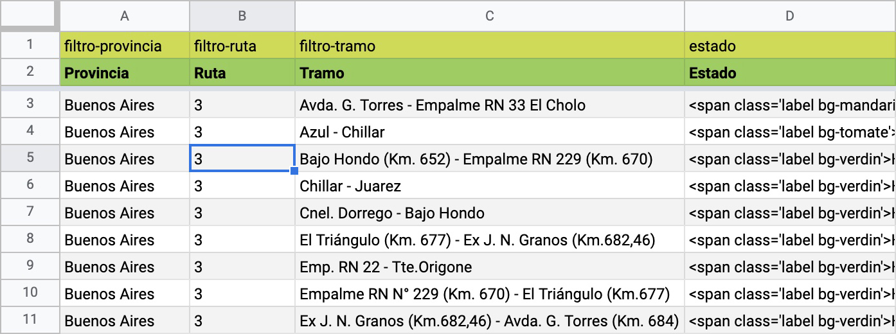
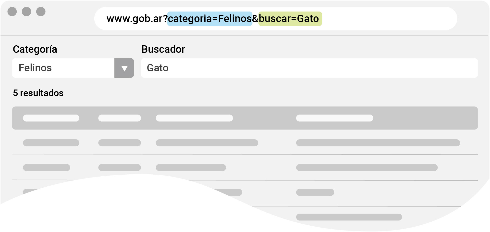
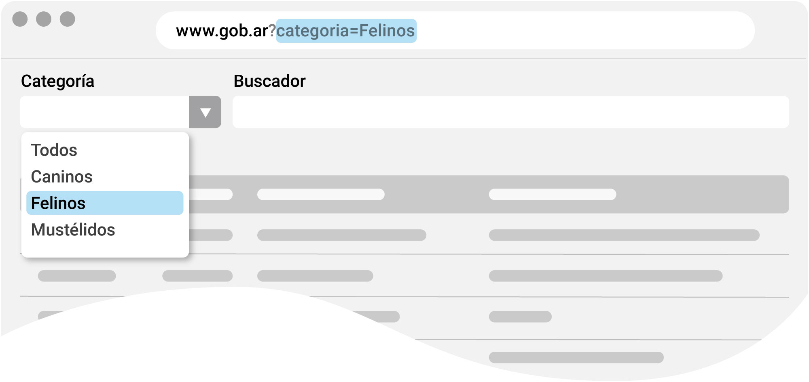
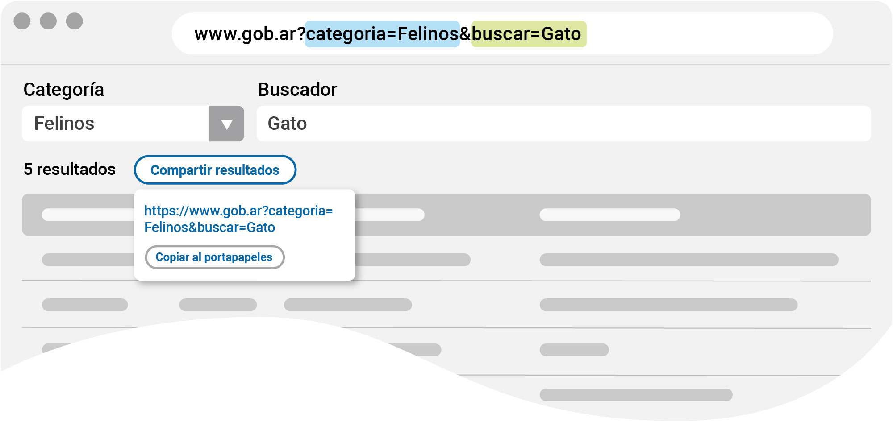

****# PonchoTable con filtros dependientes

Se trata de una variación a PonchoTable incluida en la librería de *scripts* en `poncho.min.js`.

Para esta versión se **programó** que los filtros sean dependientes uno del otro utilizando el mismo criterio de nombre de columna en GoogleSheet.

Para que los filtros funcionen en las tablas de Google, se debe usar el prefijo **filtro-**[nombre]. Entonces, una columna para un filtro de provincias quedaría: **filtro-provincia**.

<figure>

<figcaption style="font-size:small; color:gray">Captura de pantalla Google Sheet con filtros para PonchoTable</figcaption>
</figure>

****

## Opciones

| Parámetro | Tipo | Descripción |
|:---|:---|:---|
| hojaNombre | `string` | Nombre de la pestaña en [Google Sheet](https://workspace.google.com/products/sheets/) | 
| idSpread | `string` | ID del documento. Se puede copiar de la URL del documento abierto. | 
| tituloTabla | `string` | Título para la etiqueta `caption` de la tabla | 
| ordenColumna | `string` | Asigna la columna por la cual debe ordenarse la información de la tabla. |
| ordenTipo | `string` | Modo de orden ascendente (asc) o descendente (desc). |
| ocultarColumnas | `Array` | Lista de columnas que se desea ocultar |
| cantidadItems | `integer` | Cantidad de registros por página |
| jsonUrl | `string` | URL del documento o servicio JSON |
| hash | `boolean` | <p style="color:red" color>⚠ Obsoleto en nuevas versiones</p><p>Permite hacer una búsqueda pasándo un _hash_ por URL. Ej: <br>`www.argentina.gob.ar#mi-busqueda`</p> |
| filterClassList | `object` | Listado de selectores css para asignar en cada columna de filtros. Ej: <br>`filterClassList:["col-sm-6", "col-md-4"],` |
| filterContClassList | `object` | Listado de selectores css para asignar al contenedor de filtros. Ej: <br>`filterContClassList:["col-sm-6", "col-md-4"],` |
| searchContClassList | `object` | Listado de selectores css para asignar al contenedor del input de búsqueda. Ej: <br>`searchContClassList:["col-sm-6", "col-md-4"],` |
| asFilter | `object` | Permite definir un listado de items asignados a un filtro. <br>`"asFilter":  (row) => row,` |
| customEntry | `object` | Permite modificar la entrada que se mostrará en la tabla manteniendo la entrada original para el uso global de los datos.<br>`"customEntry": (row) => row,` |
| refactorEntries | `object` | Permite modificar el documento JSON en su totalidad.<br>`"refactorEntries": (row) => row,` |
| allowedTags | `object` | <p>Permite configurar un listado de etiquetas HTML que se imprimirán como parte del DOM (del inglés, *Document Object Model*), y no como un texto. Para habilitar todas las etiquetas se utiliza `["*"]`. Si se quiere especificar cuales deben usarse, ej.: `["a", "strong"]`.</p><p>Para evitar etiquetas HTML: `[]`</p> |
| jsonData | `json object` | Permite utilizar un documento JSON local o de una ubicación no asociada a Google API. |
| headers | `object` | Permite definir o redefinir los headers por cada clave. Ejemplo `{"key": "value"}`|
| orderFilter | `boolean\|object` | <p>Permite ordenar alfanuméricamente el listado de items en en cada filtro.</p><p>Utilizando el valor `true`, ordena alfanuméricamente, en forma ascendente,  todos los filtros configurados para la tabla; mientras que usando un _array object_, se puede especificar qué filtro debe ordenarse y si es en modo ascendente o descendente. Si no se utiliza la opción o, se usa con el valor `false`, los elementos del filtro tendrán el orden establecido en el documento JSON.</p><p>**Ejemplo de uso para la opción con _array object_**</p><div><p>Si no se especifica que el orden sea descendente (**desc**), se lo considera ascendente (**asc**).</p><p>`[["filtro-ubicacion", "asc"], ["filtro-estado", "desc"], ["filtro-categoria"]]`</p><p>Para declarar un filtro ascendente no hace falta agregar un _array_ dentro de otro. Usando el nombre del filtro directamente lo establece con ese orden.</p><p>`["filtro-ubicacion", ["filtro-estado", "desc"], "filtro-categoria", "filtro-genero"]`</p></div> |
| emptyLabel | `string` | Permite cambiar el _label_ en la opción vacía del desplegable. `Todos` por defecto. |
| wizard | `boolean` | Muestra los _select_ y sus opciones una vez seleccionado el filtro padre. `false` por defecto. |
| urlParams | `true` | Habilita hacer consultas desde la url, pasando parámetros para filtros e input de búsqueda. |
| pushState | `false` | Si es verdadero (true), cada vez que el usuario modifica filtros o hace búsquedas en la tabla, la dirección (url) del navegador, cambiará. |
| copyResults | `false` | Si es verdadero se activa el botón para copiar la url de resultados. |

### Query en dirección url

#### urlParams




Al incorporar parámetros a la URL, es posible filtrar y buscar datos de manera precisa dentro de la tabla. Esto permite:

* **Acceder directamente a registros individuales**: Busca un registro en particular especificando su valor en el filtro.
* **Agrupar datos por categorías**: Visualiza solo los datos que pertenecen a una categoría específica, facilitando el análisis.
* **Hacer una búsqueda global**: Permite buscar en todo el contenido de la tabla.


**Cómo habilitar esta opción.**

```js
const options = {
    ...
    urlParams: true
}
```

#### pushState



Usando esta opción la URL se actualiza incorporando parámetros asociados a las opciones que se vayan usando en los filtros desplegables o en el campo de búsqueda. 

**Cómo habilitar esta opción.**

```js
const options = {
    ...
    pushState: true
}
```


#### copyResults



Esta opción incorpora un botón desplegable que permite copiar la URL generada por las opciones de usuario en el portapapeles. 

**Cómo habilitar esta opción.**

```js
const options = {
    ...
    copyResults: true
}
```


### Opción para modo Wizard

Para poder mostrar u ocultar elementos html en función de la visibilidad de la tabla, se puede utilizar el siguiente _dataset_ con su valor en `boolean`: `data-visible-as-table`.

#### Uso

```html
<div class="alert alert-info" data-visible-as-table="false">
  <p>Para acceder al formulario, elegí tipo de documento, provincia y motivo.</p>
</div>
```

El valor en `false`, hará que cuando la tabla **no esté visible** el elemento con el dataset, se visualice.


```html
<div class="alert alert-info" data-visible-as-table="true">
  <p>Busque un resultado en la tabla.</p>
</div>
```

El valor en `true`, hará que cuando la tabla **esté visible** el elemento con el dataset, se visualize.


## Scripts

### PonchoTable

```html
<!-- INCLUDE SCRIPTS -->
<script src="/profiles/argentinagobar/themes/contrib/poncho/js/datatables.min.js"></script>
<script src="/profiles/argentinagobar/themes/contrib/poncho/js/poncho.min.js"></script>
<link href="/profiles/argentinagobar/themes/contrib/poncho/css/ponchoTable-1.1.css" rel="stylesheet">
<!-- / INCLUDE SCRIPTS -->
```

### Scripts complementarios


```html
<!-- INCLUDE COMPLEMENTARY SCRIPTS -->
<script src="/sites/default/files/ponchotable/showdown.js"></script>
<script src="/profiles/argentinagobar/themes/argentinagobar/argentinagobar_theme/js/extensiones/showdown-extensions.js"></script>
<!-- / INCLUDE COMPLEMENTARY SCRIPTS -->
```


## Código HTML

```html
<!-- FILTERS -->
<div class="row">
  <div class="col-sm-12 col-md-8" id="ponchoTableFiltroCont" style="display:none">
    <div class="row" id="ponchoTableFiltro"></div>
  </div>
  <div class="col-sm-12 col-md-4" id="ponchoTableSearchCont" style="display: none">
    <div class="form-group">
      <label for="ponchoTableSearch">Buscá por palabra clave</label>
      <input class="form-control" id="ponchoTableSearch" type="search">
    </div>
  </div>
</div>
<!-- / FILTERS -->
<!-- TABLE -->
<div class="row">
  <div class="col-md-12 m-b-4">
    <table class="table table-condensed table-striped" id="ponchoTable">
      <caption></caption>
      <thead></thead>
      <tbody></tbody>
    </table>
  </div>
</div>
<!-- / TABLE -->
```


## Código JavaScript para llamar a PonchoTable

```html
<script>
(function($) {
    const gapi = new GapiSheetData();
    const url = gapi.url("dataset", "1vVSk7...C2TKBw");
    var options = {
        jsonUrl: url,
        tituloTabla: "Listado de escuelas",
        ordenColumna: 1,
        ordenTipo: "asc",
        ocultarColumnas: [],
        cantidadItems: 15, 
        hash: true,
        filterClassList: ["col-sm-12", "col-md-6"],
        allowedTags: ["*"],
        orderFilter: true, 
    };
    ponchoTableDependant(options);
})(jQuery);
</script>
```
