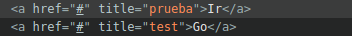

# Traductor de cadenas de texto


## Parámetros iniciales


```javascript
const tr = new TranslateHTML(param_0, param_1);
```


| Parámetro | Tipo | Default | Descripción |
|:---|:---|:---|:---| 
| 0 | object | `[]` | Diccionario de términos a traducir. Este párametro es obligatorio |
| 1 | object | `[]` | Listado de selectores y atributos especiales que deben utilizarse. |

### Métodos

#### translate()

Ejecuta la función para traducir el documento.

```javascript
tr.translate();
```

#### translateAttributes();

Traduce los atributos de una etiqueta, ej: `title` en `<a href="#" title="prueba">`.

```javascript
tr.translateAttributes();
```
##### Ejemplo de traducción de atributos



<small>En la imagen la primer línea muestra el texto original y en la segunda la traducción del texto y el atributo.</small>

## 📙 Diccionario de términos a traducir

El componenete necesita un diccionario de términos a traducir. Los términos pueden estar representados en cualquier idioma. El programa buscará el texto y lo reempñazará por el texto que se le asignó. 

### Sintáxis

```json
[
    [
        "Acerca de la República Argentina",
        "About the Argentine Republic"
    ],
    [
        "Compartir en redes sociales",
        "Share on Social Media"
    ],
    [
        "Compartir en",
        "Share on"
    ]
]
```
s
## 🚀 Uso

Importar `poncho.min.js`.

```javascript
<script src="/profiles/argentinagobar/themes/contrib/poncho/js/poncho.min.js"></script>
```
<small>* Controle que la url sea la correcta.</small>


```javascript
<script>
    fetch_json("ln-es.json").then(terms => {
        const tr = new TranslateHTML(
            terms,
            ["html.lang", "a.lang", "value", "title", "placeholder"]
        );
        tr.translate();
    });
</script>
```

### Traducir atributos HTML

```javascript
<script>
    fetch_json("ln-es.json").then(terms => {
        const tr = new TranslateHTML(terms, ["html.lang", "a.lang", "value", "title", "placeholder"]);
        tr.translate();
        tr.translateAttributes([...terms, ...[["es", "en"]]]);
    });
</script>
<!-- END -->
```
